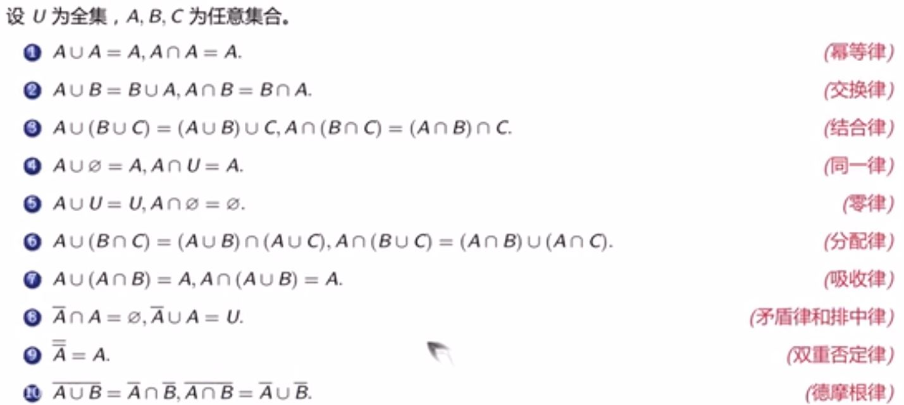

# 集合基础

### 集合

包含（⊆）：B是A的子集（B被A包含，A包含B），记作B⊆A

真包含（⊆）：B是A的真子集（B⊆A且B≠A），记作B⊂A

### 幂集

A的所有子集构成的集合，记为P(A)

**e.g.**：A={a, {b, c}}，则P(A)={Ø, {a}, *{{b, c}}*, {a, {b, c}}}

### 定理

x∈P(A)⇔x⊆A

### 差集

### 对称差集

A⊕B

### 集合运算

---

### 等势

### 可数集合

### 不可数集合

