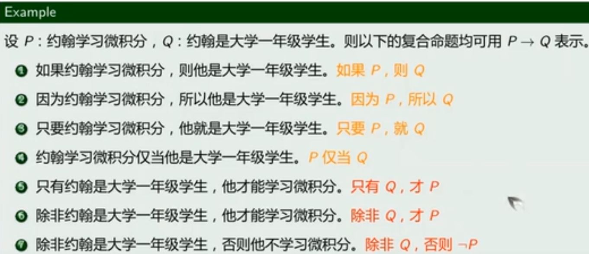
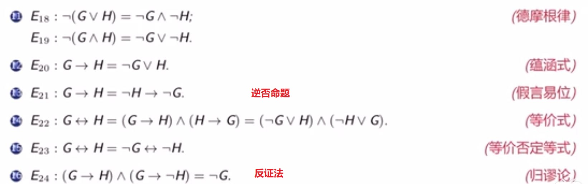
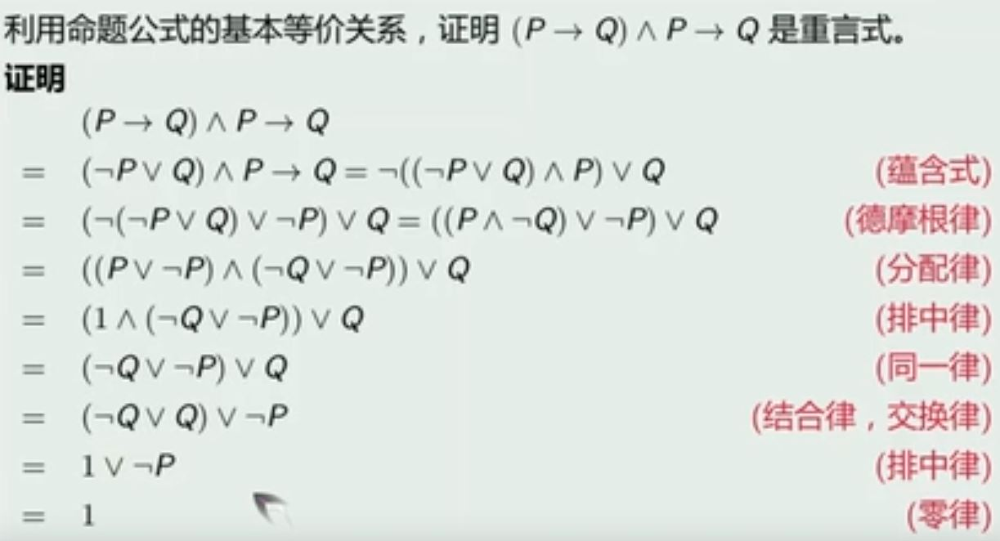
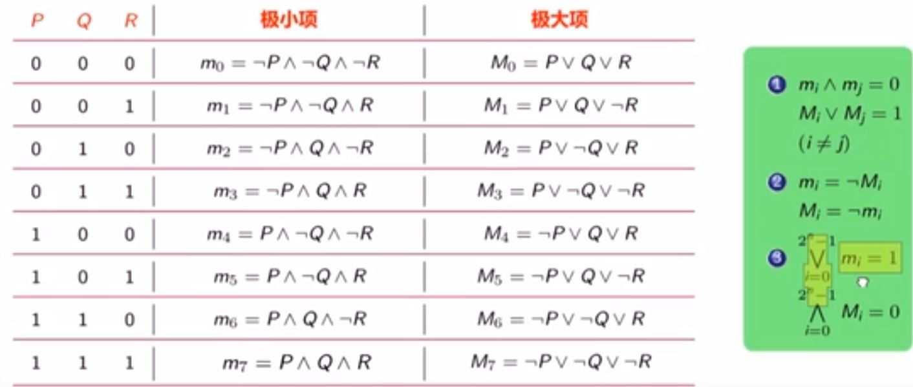
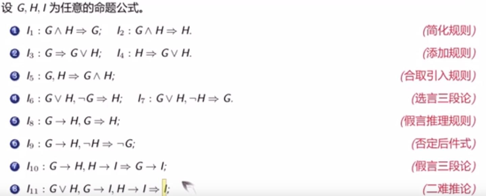
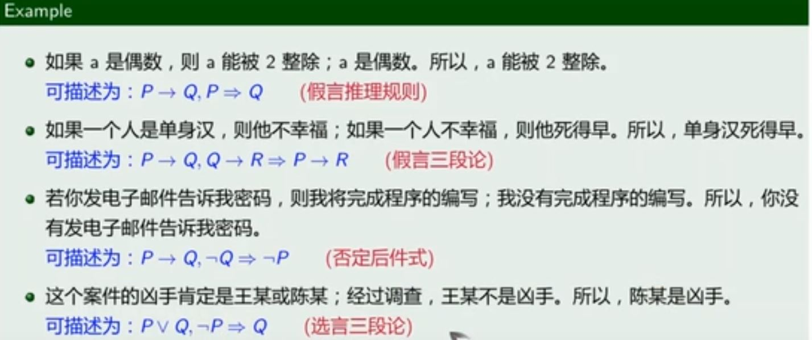

# 数理逻辑

## 命题

具有**确切真值的陈述句**称为命题，真值只能取真或假

## 复合命题

def：由简单命题用联结词联结而成的命题

### 联结词

否定联结词（¬）、合取联结词（∧）、析取联结词（∨）、蕴含联结词（→）、等价联结词（↔，当且仅当）

#### 蕴含联结词

#### 优先级

否定、合取、析取、蕴含、等价（从左到右，从未失手）

e.g. 	¬P∨¬Q→R∧S↔T运算步骤

## 命题公式

命题公式是对由命题变项、联结词和圆括号按照一定逻辑关系构成的复合命题的形式化描述。**命题公式本身不是命题**，没有真值，只有对其命题变项进行赋值后，它才有真值。

### def

(1)命题变项是命题公式。

(2)如果A是命题公式，则¬A是命题公式。

(3)如果A和B是命题公式，那么(A∧B)、(A∨B)、(A→B)和(A↔B)都是命题公式。

(4)当且仅当有限次地应用(1)，(2)，(3)所得到的包含命题变项，联结词和圆括号的符号串是命题公式。

### 基本等价关系

e.g. 

# 范式

## 极小项和极大项

每个命题变元与其否定不同时存在，但二者之一恰好只出现一次，并且出现的次序与P1, P2, ..., Pn一致，则称为关于P1, P2, ..., Pn的一个极小项或极大项

### 性质

## 主析取范式和主合取范式

主析取范式：**析取范式**中，每个短语都是**极小项**且**按照编码从小到大**排列。析取范式可以指出公式何时为真

主合取范式：**合取范式**中，每个短语都是**极大项**且**按照编码从小到大**排列。合取范式可以指出公式何时为假

## 范式转化

主析取范式使用的极小项编码和主合取范式使用的极大项编码是**“互补”**关系

e.g.  G的主析取范式为m0∨m3，则G的主合取范式为M1∧M2

# 推理

## 推理关系

e.g.

