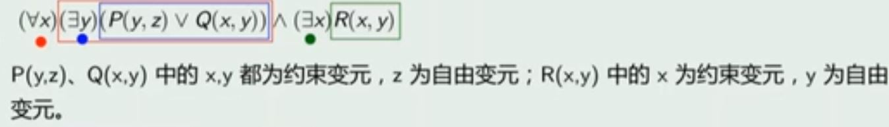

# 谓词逻辑

## 谓词的引入

原因：命题逻辑具有局限性

e.g.	 含变量的语句：x>3

因为命题是**有确切真值的陈述句**，故可拆分为主语和谓语

## 个体词与谓词

def：在原子命题中，可以**独立存在的客体（主语、宾语等）**，称为个体词（包括个体常量和个体变量，小写字母表示）。而用来**刻划客体的性质或客体之间的关系**即是谓词（也分常量和变量，大写字母表示）

e.g.	

- 小张和小李同岁。描述为：F(a, b), 其中a: 小张, b: 小李，F为谓词常量
- x与y具有关系L。描述为：L(x, y), L为谓词变量

### 谓词说明

- 一元谓词用以描述一个个体的某种特性，而n元谓词（n>=2）用以描述n个个体之间的关系
- 谓词P(x1, x2, ... , xn)包含了个体变量，因而本身不是命题，只有当用谓词常量取代P，用个体常量取代所有个体变量后才会成为命题
- 一般将**没有任何个体变量**的谓词称为**0元谓词**，如F(a)。当F为谓词常量时，0元谓词就变成了命题

## 量词的引入

e.g.

- 没有人登上过木星

  H(x): x是人，M(x)：x登上过木星

  ¬(∃x)(H(x)∧M(x))或(∀x)(H(x)→¬M(x))

- 尽管有人很聪明，但未必所有人都很聪明

  H(x): x很聪明，M(x)：x是人

  (∃x)(M(x)∧H(x))∧¬(∀x)(M(x)→H(x))

- 有时候，可以不使用全总个体域，如：每个实数都存在比它大的另外的实数

  R(x): x是实数，L(x, y)：x小于y

  (∀x)(R(x)→(∃y)(R(y)∧L(x, y)))，若假定个体域为所有实数，则为(∀x)(∃y)L(x, y)

## 谓词合式公式

### 引入函数

函数可用于表达个体词之间的转换关系，给谓词逻辑中的个体词带来了很大的方便

### 项

### 合式公式

若P(x1, x2, ..., xn)是n元谓词，t1, t2, ..., tn是项，则称P(t1, t2, ..., tn)是原子公式

合式公式def：

- 原子公式是合式公式
- 若G, H是合式公式，则(¬G), G∧H, G∨H, G→H, G↔H均为合式公式
- 若G是合式公式，x是个体变量，则(∃x)G, (∀x)G也是合式公式
- 有限次使用以上三个规则产生的表达式才是合式公式

 ### 自由变元与约束变元

def：合式公式G，若变元x出现在使用变元的量词的辖域内，则称x的出现为约束出现，x为约束变元；否则称为自由变元。

e.g.

### 闭式

def：G是任意一个公式，若G中无自由出现的个体变元，则称G为封闭的合式公式

显然，闭式是一个命题

### 谓词演算基本公式

除了包括命题的那些公式之外，还有其他的公式如下

## 前束范式

def：

