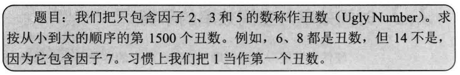
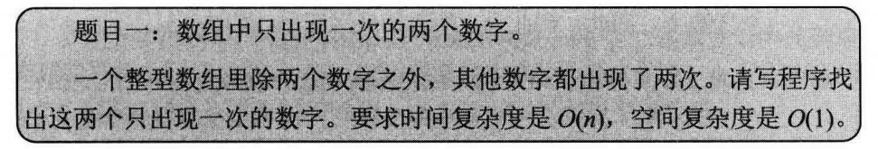
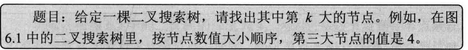
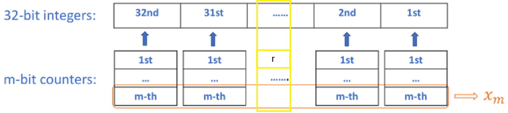

## question1



思路：从第一个丑数1开始，它有3种选择，×2、×3、×5。选择其中最小的即2，判断它是从哪个丑数过来的（即与1×2，1×3，1×5相比较），对应的index加1。然后要选择第二个丑数，这时选择变为1×3，1×5，2×2（也就是说，1还有两种选择，且要最小，则2只有一种选择即×2）。选择最小的即3，判断它是从1×3过来的，对应的index加1。最后，要选择第三个丑数，这时选择为1×5，2×2，2×3。选择最小的即4，判断它是从2×2过来的，对应的index加1。依次往复

```c++
int min(int a,int b,int c){
        return a>b?(b<c?b:c):(a<c?a:c);
}
int nthUglyNumber(int n) {
    int* u=new int[n];
    u[0]=1;
    int index2=0;
    int index3=0;
    int index5=0;
    int k=1;
    while(k<n){
        u[k]=min(u[index2]*2,u[index3]*3,u[index5]*5);
        if(u[index2]*2==u[k])index2++;
        if(u[index3]*3==u[k])index3++; // 不能用else if，否则会出现重复计算，如2*3 与 3*2
        if(u[index5]*5==u[k])index5++;
        k++;
    }
    return u[n-1];
}
```

## question2



思路：数组所有的数字异或，结果等于要找的两个数字的异或。结果中找到第一个不为0的位，该位与后面的0构成一个数，将该数与数组的数字异或，如果为0，放入1组，为1则放入2组。1组的数字异或即可得到一个数，2组的数字异或可得到另一个数。

## question3



思路：如果是空节点，返回val；否则看左子树返回的数是否等于k-1，若是的话则当前节点上**第k小的数**；否则把val传入右子树。根据题目，就是把左右子树换下位置。

## question4

求两个节点p，q的最近相同父节点。

**思路：？**

## question5：前缀和

给一个未排序的整型数组，有多少个子数组的和等于target

```java
Input : arr[] = {10, 2, -2, -20, 10}, 
        target = -10
Output : 3
Subarrays: arr[0...3], arr[1...4], arr[3..4]
have sum exactly equal to -10.

Input : arr[] = {9, 4, 20, 3, 10, 5},
        target = 33
Output : 2
Subarrays : arr[0...2], arr[2...4] have sum
exactly equal to 33.
```

思路：遍历数组，将当前指针指向的值加入到currSum，如果currSum等于target，则找到一组子数组；将currSum-target得到一个数，若前面的子数组的和与该数相同，则找到前面子数组的和的组数

```java
/* 举例说明 arr[] = {10, 2, -2, -20, 10}, target = -10
在执行prevSum.merge(currSum, 1, Integer::sum)语句之前
第一趟循环：currSum=10, res=0
第二趟循环：currSum=12, res=0, prevSum={10=1}
第三趟循环：currSum=10, res=0, prevSum={10=1,12=1}
第四趟循环：currSum=-10,res=1, prevSum={10=2,12=1}。这里currSum==target
第五趟循环：currSum=0, res=3, , prevSum={10=2,12=1,-10=1}。这里是后一种情况，key=currSum-target=0-(-10)=10，map中一个是10,另一个是10,2,-2，因而结果为[2,-2,-20,10]与[-20,10]。
子数组中若有和等于key，则说明该指针+1到末尾的和则恰好等于target，因为把该指针及之前的和s移除，就等价于 ** currSum - s == target **
*/
// 代码实现
Map<Integer, Integer> prevSum = new HashMap<>();  
int res = 0, currSum = 0;
for(int i = 0; i < arr.length; i++){
    currSum += arr[i];
    if(currSum == sum)	res++;
    if(prevSum.containsKey(currSum - target))	res += prevSum.getKey(currSum - target);
    prevSum.merge(currSum, 1, Integer::sum);
}
return res;
```

## question6

[137. Single Number II](https://leetcode.com/problems/single-number-ii)

Given a **non-empty** array of integers, every element appears *three* times except for one, which appears exactly once. Find that single one.

**Note:**

Your algorithm should have a linear runtime complexity. Could you implement it without using extra memory?

**Example 1:**

```java
Input: [2,2,3,2]
Output: 3
  
Input: [0,1,0,1,0,1,99]
Output: 99
```

思路：先扩展题目，到一般性

```java
Given an array of integers, every element appears k (k > 1) times except for one, which appears p times (p >= 1, p % k != 0). Find that single one.
```

1. 考虑只有1位数，即0/1

   定义一个counter，统计1的个数，当到达k时，counter置为0。假设counter有m位，即 $x_m, ... x_2, x_1$ 。显然，counter的规则是当遇到0时不变，遇到1时+1。有两种选择 `x = x | i 或 x = x ^ i` ，判断哪个对的

   ```java
   // 若counter从1变为2,  counter为 0,1 变为 1,0
   // x = x | i, i = 1, x1=1, 操作过后x1=1
   // x = x ^ i, i = 1, x1=1, 操作过后x1=0
   当x1=1，i=1，遇到1后需要x2=1，x1=0 // x2 = x2 ^ (x1 & i)
   ```

   `2^m 与 k`的关系： $k <= 2^m, 即 logk < m$ ，当取不到等号时，我们可以定义一个mask，当counter到达k时，使mask变为0，这样的话 $x_m \& mask = 0, ...,  x_1 \& mask = 0$ 。mask与k之间的关系为，mask = ~(km& ...& ~k2& ~k1)，当k的位是0时，取反

   ```java
   k = 3: k1=1, k2=1  ==> mask = ~(k2 & k1)
   k = 5: k1=1, k2=0, k3=1  ==> mask = ~(k3 & ~k2 & k1)
   ```

2. 考虑到32位整型

   我们可以直接构建32个m位的计数器，但还有另一种方法，即构建m个32位的计数器（举例来说，x2与x1，前一种是32个2位的计数器，但是后一种，相当于并行地对每个计数器进行异或操作，所以结果是一致的）。

   

3. 返回结果

   定义 $x_1^{r}$ ：x1的第r位上的表示（0或1） 。$x_1^{r}$ 表示所有数第r位为1总数的最低位的值（0或1）

   $x_1^{r}$ =1的条件是：1）某数第r位是1（若为0，counter是一直为0的）；2）该数不能出现k次（出现k次后mask = 0, $x_1^{r}$ & mask为0）。

   只出现p次的单个元素，若p>k，则k* `p/k向下取整` 对于$x_1^{r}$ 没有贡献，所以有效次数为 $p^{'} =  p \% k$ 

   让我们假设 $p^{'}$ 的二进制形式为 $p^{'}_m, ... , p^{'}_2, p^{'}_1$ 。我们可以证明 $x_j$ 就是要返回的结果，只要 $p^{'}_j = 1(j = 1, ..., m)$ 。

   ```
   如果xj的第r位是1，那么肯定是单独的那个数决定的。现在证明假设xj的第r位是0，单独数的第r位必须是0
   反证法
   假设单独数的第r位是1，那么结束之后会有p'个，而有p'j=1，则xj的第r位是1，与假设矛盾
   ```

   另附： $x_j^r = 0$ if $p_j^{'} = 0$  and $x_j^r = 1$ if $p_j^{'} = 1$  ，也就是说我们可以用 $x_1 | x_2 | ... | x_m$ 来表示单独的数

   ```
   简单证明xj的第r位为0时p'j的第r位也是0
   从上述有xj的第r位为1时，p'j的第r位也是1。若p'为奇数，前者成立，那么当xj的第r位是0，对应的p'j第r位也必然为0（是1的话xj的第r位是1）；若p'为偶数，每一位都为0，不成立，故舍去。
   证明只要有xj的第r位为1，则xj的其他位都是由p'j提供的
   ```

4. examples

   ```java
   // k = 2, p = 1
   // k is 2, then m = 1, we need only one 32-bit integer (x1) as the counter. And 2^m = k so we do not even need a mask! A complete java program will look like:
   public int singleNumber(int[] nums) {
       int x1 = 0;
   
       for (int i : nums) {
           x1 ^= i;
       }
   
       return x1;
   }
   
   // k = 5, p =3
   // k is 5, then m = 3, we need three 32-bit integers(x3, x2, x1) as the counter. And 2^m > k so we need a mask. Write k in its binary form: k = '101', then k1 = 1, k2 = 0, k3 = 1, so we have mask = ~(x1 & ~x2 & x3). A complete java program will look like:
   public int singleNumber(int[] nums) {
       int x1 = 0, x2 = 0, x3  = 0, mask = 0;
   
       for (int i : nums) {
           x3 ^= x2 & x1 & i;
           x2 ^= x1 & i;
           x1 ^= i;
           mask = ~(x1 & ~x2 & x3);
           x3 &= mask;
           x2 &= mask;
           x1 &= mask;
       }
   
       return x1;  // Since p = 3, in binary form p = '011', then p1 = p2 = 1, so we can return either x1 or x2. 
       // If p = 4, in binary form p = '100', only p3 = 1, which implies we can only return x3.
       // Or alternatively we can simply return (x1 | x2 | x3).
   }
   ```

## question7

[Longest Increasing Subsequence](https://leetcode.com/problems/longest-increasing-subsequence/)

描述：求最长上升子序列，返回其长度

思路1：DP。用dp[i]表示第一个数到第i个数的最长上升子序列长度，有
$$
dp[i] =  \left\{ \begin{array}{ll} max(dp[i], dp[j]+1) & \mbox{if nums[i] > nums[j]}, for \ j < i \\ 
dp[i]& \mbox{if nums[i] <= nums[j]} \end{array} \right.
$$
思路2：上述的DP复杂度为O(n^2)，如果将DP与二分查找结合起来，则复杂度为O(nlogn)。dp[i]表示长度为i+1的递增子序列的末尾元素的最小值，我们所要做到就是尽量在长度不变（或增加）的情况下减小dp[i]表示的元素，若能减小dp[i]之前的元素，那么就有可能减小dp[i]的元素

**拓展**：

1. 如何求最长不降子序列的长度？

   so easy，只不过是把DP中的“=”移到上面

2. 如何追踪这个序列？

   用思路2，每次找到一个元素可能减小递增子序列中的元素时，让此元素指向其前面的元素，并且替换当前的位置的元素，最后遍历的时候从最后一个元素开始，因为它维护了其前面的元素。**注意**：当相同长度的递增子序列有多个时，只会返回最后面的子序列

## question8

[1330.Reverse Subarray To Maximize Array Value](https://leetcode.com/problems/reverse-subarray-to-maximize-array-value/)

You are given an integer array `nums`. The *value* of this array is defined as the sum of `|nums[i]-nums[i+1]|` for all `0 <= i < nums.length-1`.

You are allowed to select any subarray of the given array and reverse it. You can perform this operation **only once**.

Find maximum possible value of the final array. 

**Example 1:**

```
Input: nums = [2,3,1,5,4]
Output: 10
Explanation: By reversing the subarray [3,1,5] the array becomes [2,5,1,3,4] whose value is 10.

Input: nums = [2,4,9,24,2,1,10]
Output: 68
```

**Constraints:**

- `1 <= nums.length <= 3*10^4`
- `-10^5 <= nums[i] <= 10^5`

**思路**：[ref1](https://leetcode.com/problems/reverse-subarray-to-maximize-array-value/discuss/489882/O(n)-Solution-with-explanation) 、[ref2](https://leetcode.com/problems/reverse-subarray-to-maximize-array-value/discuss/489743/JavaC%2B%2BPython-One-Pass-O(1)-Space)

假设数组为：`x,y, ... , a,[b,...,c],d,...`，准备翻转的是[b,...,c]，因为翻转后b与c之间的和并不会变，因此只需考虑翻转后a,b,c,d四个数，即比较abs(a-b)+abs(c-d)与abs(a-c)+abs(b-d)，若后者大于前者，则是一种可能翻转的情况。而abs(a-b) = max(a, b) - min(a, b)

翻转之前的状态有两种情况：1）max(a,b)>=min(c,d)，有相交；2）max(a,b)<min(c,d)，无相交。

1. 有相交

   翻转后增益小于等于0，故该情况不可能翻转

2. 无相交

   翻转后增益为`min(c,d)-max(a,b)的2倍`，只有这样的情况可能翻转

要使增益最大，则需要max(min(c,d) for pair c,d) & min(max(a, b) for pair a,b)

**注意边界点**：当b=nums[0]或c=nums[len-1]，要特别处理，并与上面得到的增益e进行比较，最终选择最大的增益

1. b=nums[0]

   增益为abs(b-d)-abs(c-d)

2. c=nums[len-1]

   增益为abs(a-b)-abs(a-c)

故结果为total+max(e, bound)

## question10

二分题目：[1283. Find the Smallest Divisor Given a Threshold](https://leetcode.com/problems/find-the-smallest-divisor-given-a-threshold)、[410.Split Array Largest Sum](https://leetcode.com/problems/split-array-largest-sum/)、[774.Minimize Max Distance to Gas Station](https://leetcode.com/problems/minimize-max-distance-to-gas-station)、[875.Koko Eating Bananas](https://leetcode.com/problems/koko-eating-bananas)、[1011.Capacity To Ship Packages In N Days](https://leetcode.com/problems/capacity-to-ship-packages-within-d-days)、[1231.Divide Chocolate](https://leetcode.com/problems/divide-chocolate)

## question11：单调栈

思路：使用单调栈

1. 什么是单调栈？

   分为单调递增栈和单调递减栈。单调递增栈即栈内元素保持单调递增的栈

2. 有什么用呢？

   举例：一个数组[5,3,7,4]，找到所有元素左边第一个比它小的元素的位置

   暴力枚举的方法时间复杂度为O(N^2)，而使用单调栈能在O(N)实现

   ```java
   // 我们按顺序遍历数组，然后构造一个单调递增栈（存储下标），L[i]记录在当前元素左边的第一个比它小的元素
   // 1. 栈为空，L[0] = 0，栈：0
   // 2. 3<5, L[1] = 0, 5弹出栈，栈:1
   // 3. 7>3, L[2] = 1, 栈:1,2
   // 4. 3<4<7, L[3] = 1, 7弹出栈, 栈:1,3
   public static void leftMinIndex(int[] arr){
       int[] L = new int[arr.length];
       Deque<Integer> monoStack = new ArrayDeque<>();
       for(int i = 0; i < arr.length; i++){
           while(!monoStack.isEmpty() && arr[monoStack.peek()] > arr[i])   monoStack.pop();
           L[i] = stack.isEmpty() ? 0 : stack.peek();
           stack.push(i);
       }
   }
   ```

3. 应用

   - 某个元素左边第一个比它小的元素的下标

     分析：不论是单调递增栈还是单调递减栈，当该元素大于栈顶元素时，左边第一个比它小的元素就是栈顶。如果用*单调递增栈*，若小于栈顶元素，弹出栈顶直到大于栈顶元素；如果用单调递减栈，若小于栈顶元素，弹出直到大于栈顶元素（那栈必然为空了，因为栈顶元素最小的元素，故舍去）

   - 某个元素左边第一个比它大的元素的下标

   - 某个元素右边第一个比它小的元素的下标

   - 某个元素右边第一个比它大的元素的下标

     顺序可以直接维护一个*单调递减栈*。也可以用逆向思维，一个数组中某个元素右边第一个比它大的元素，等价于数组倒序该元素左边第一个比它大的元素，因此可以推出维护一个单调递减栈。

   - **补充**：左边的定义是相对于遍历方向的，如d中的数组倒序，方向是[len-1, 0]，对于元素i来说，它的左边是[len-1, i]，右边是[i, 0]

## question12：树中序遍历之Morris

树的中序遍历

```java
public void inOrder(TreeNode root){
    if(root == null)	return;
    inOrder(root.left);
    // 对当前节点的操作。。
    inOrder(root.right);
}
// 时间复杂度O(N)，空间复杂度O(H)，即树高。递归调用时要保存中间节点到最左边节点之间的所有节点
```

Morris遍历，每个节点访问2次，能以时间复杂度O(N)、空间复杂度O(1)实现树的中序遍历。思想是：

1. 对于一个节点，首先要访问它的前序节点
   1. 如果该节点有左孩子，则从左孩子开始，一直走右指针直到底，得到的节点就是其前序节点
   2. 如果该节点无左孩子，且它是父节点的右孩子，则其前序节点就是父节点
   3. 如果该节点无左孩子，且它是父节点的左孩子，则其是首节点
2. 算法步骤：
   1. 根据当前节点，找到其前序节点，如果前序节点的右孩子为空，则将前序节点的右孩子指向当前节点，然后进入当前节点的左孩子
   2. 如果当前节点的左孩子为空，则操作当前节点，进入右孩子
   3. 如果当前节点的前序节点的右孩子指向了它本身，则把前序节点的右孩子设为空，操作当前节点，然后进入右孩子

```java
while(cur != null){
    if(cur.left == null){
        /* 操作中。。。*/
        // 然后进入右节点
        pre = cur;
        cur = cur.right;
    }else{ // 进入左子树
        // 找当前节点的前序节点
        TreeNode predecessor = cur.left;
        while(predecessor.right != null && predecessor.right != cur)	predecessor = predecessor.right;
        
        if(predecessor.right == cur){ // 如果前序节点的右孩子指向了自己，说明左边已经遍历完了
            /* 操作中。。。*/
            // 进入当前节点的右节点
            predecessor.right = null;
            pre = cur;
            cur = cur.right;
        }else{ // 前序节点没有指向自己，左边还没有遍历完
            /* 操作中。。。*/
            // 进入当前节点的左节点
            predecessor.right = cur;
            cur = cur.left;
        }
    }
}
```

## question14：单调队列

[239. Sliding Window Maximum](<https://leetcode-cn.com/problems/sliding-window-maximum/>)

