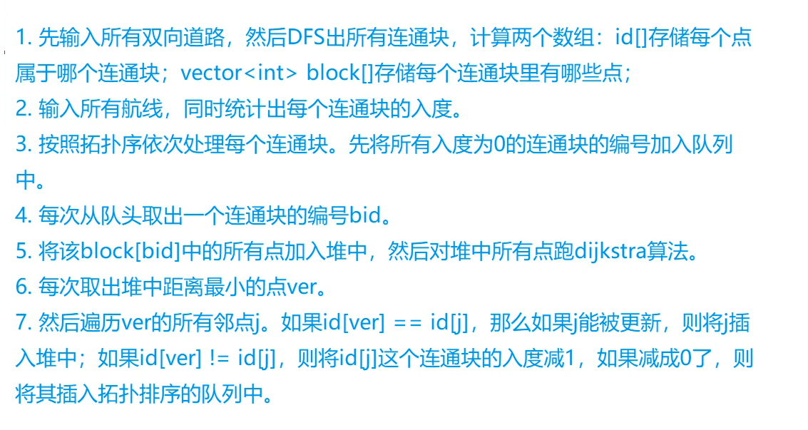

# 单源最短路的应用

## 虚拟源点

[昂贵的聘礼](https://www.acwing.com/problem/content/905/)


```c++
#include <iostream>
#include <cstring>
using namespace std;

const int N = 110;
int n, m;
int w[N][N], dist[N], level[N];
bool st[N];

void dijkstra(int down, int up){
    memset(dist, 0x3f, sizeof dist);
    memset(st, 0, sizeof st);
    dist[0] = 0;
    for(int i = 0; i <= n; i++){
        int t = -1;
        for(int j = 0; j <= n; j++)
            if(!st[j] && (t == -1 || dist[t] > dist[j]))
                t = j;
        st[t] = true;
        for(int j = 0; j <= n; j++)
            if(level[j] >= down && level[j] <= up)
                dist[j] = min(dist[j], dist[t] + w[t][j]);
    }
}

int main(){
    scanf("%d%d", &m, &n);
    memset(w, 0x3f, sizeof w);
    for(int i = 1; i <= n; i++){
        int cnt;
        scanf("%d%d%d", &w[0][i], &level[i], &cnt);
        while(cnt--){
            int u, v;
            scanf("%d%d", &u, &v);
            w[u][i] = min(w[u][i], v);
        }
    }
    int res = 0x3f3f3f3f;
    // 等级制度。可以枚举每个等级区间，每次求最短路只更新在这个区间里面的物品
    // 酋长必须选，酋长的等级可能不是最高的
    for(int i = level[1] - m; i <= level[1]; i++){
        dijkstra(i, i + m);
        res = min(res, dist[1]);
    }
    cout << res << endl;
    return 0;
}
```


[选择最佳线路](https://www.acwing.com/problem/content/1139/)

思路：反向建图虽然也能解决，但不具有拓展性。用虚拟源点的话拓展性好。

```c++
#include<iostream>
#include<cstring>
using namespace std;

const int N = 1010, M = 21010;
int n, m, s, cnt;
int h[N], e[M], w[M], ne[M], idx;
int dist[N], q[N];
bool st[N];

void add(int a, int b, int c){
    e[idx] = b, w[idx] = c, ne[idx] = h[a], h[a] = idx++;
}

int spfa(){
    memset(dist, 0x3f, sizeof dist);
    dist[0] = 0;
    st[0] = true;
    int hh = 0, tt = 1;
    q[0] = 0;
    while(hh != tt){
        int ver = q[hh++];
        if(hh == N) hh = 0;
        st[ver] = false;
        for(int i = h[ver]; ~i; i = ne[i]){
            int j = e[i];
            if(dist[j] > dist[ver] + w[i]){
                dist[j] = dist[ver] + w[i];
                if(!st[j]){
                    q[tt++] = j;
                    if(tt == N) tt = 0;
                    st[j] = true;
                }
            }
        }
    }
    return dist[s] == 0x3f3f3f3f ? -1 : dist[s];
}

int main(){
    while(scanf("%d%d%d", &n, &m, &s) != -1){
        memset(h, -1, sizeof h);
        idx = 1;
        while(m--){
            int a, b, c;
            scanf("%d%d%d", &a, &b, &c);
            add(a, b, c);
        }
        scanf("%d", &cnt);
        while(cnt--){
            int b;
            scanf("%d", &b);
            add(0, b, 0);
        }
        printf("%d\n", spfa());
    }
    return 0;
}
```


## 结合暴搜(dfs)

[新年好](https://www.acwing.com/problem/content/1137/)

思路：枚举每一个拜访顺序，在该顺序（假设为1->a->c->b->e->d）下求最短路，即一个顺序求6次最短路，时间复杂度为O(5! × 6 × O(最短路算法))，时间复杂度太高。我们可以换个方向考虑，先求出每个点到其他点的最短路，然后再枚举顺序，时间复杂度为O(6 × O(最短路算法) + 5!)

```c++
#include <iostream>
#include <cstring>
#include <queue>

using namespace std;
typedef pair<int, int> PII;

const int N = 50010, M = 200010;
int n, m, res;
int h[N], e[M], w[M], ne[M], idx;
int dist[6][N], id[6];
bool st[N], marked[6];

void add(int a, int b, int c){
    e[idx] = b, w[idx] = c, ne[idx] = h[a], h[a] = idx++;
}

void dijkstra(int dist[], int start){
     memset(dist, 0x3f, N * 4);
     memset(st, 0, sizeof st);
     dist[start] = 0;
     priority_queue<PII, vector<PII>, greater<PII>> heap;
     heap.push({0, start});
     while(!heap.empty()){
         auto t = heap.top();
         heap.pop();
         int distance = t.first, ver = t.second;
         if(dist[ver] < distance)   continue;
         for(int i = h[ver]; ~i; i = ne[i]){
             int j = e[i];
             if(dist[j] > distance + w[i]){
                 dist[j] = distance + w[i];
                 heap.push({dist[j], j});
             }
         }
     }
}

void dfs(int u, int start, int sum){
    if(u == 5){
        res = min(res, sum);
        return;
    }
    // i表示第i个亲戚家，id[i]表示实际的车站
    for(int i = 1; i <= 5; i++){
        if(!marked[i]){
            marked[i] = true;
            dfs(u + 1, i, sum + dist[start][id[i]]);
            marked[i] = false;
        }
    }
}

int main(){
    scanf("%d%d", &n, &m);
    memset(h, -1, sizeof h);
    id[0] = 1;
    for(int i = 1; i <= 5; i++)  scanf("%d", &id[i]);
    while(m--){
        int u, v, w;
        scanf("%d%d%d", &u, &v, &w);
        add(u, v, w), add(v, u, w);
    }
    // 分别求出从车站1，a，b，c，d，e出发到其他站的最短距离
    for(int i = 0; i < 6; i++)  dijkstra(dist[i], id[i]);
    
    res = 0x3f3f3f3f;
    dfs(0, 0, 0);
    printf("%d\n", res);
    return 0;
}
```


## 结合二分

[通信线路](https://www.acwing.com/problem/content/description/342/)

思路：最少需要多少钱来升级价格为k+1贵的那条电缆，联想到二分。设要升级的电缆价格为x，那么价格低于它的可以看成是0（不用付钱），价格高于它的可以看成是1（前k大），求一下最短路，判断从1到N的价格高于x的电缆数量是否小于等于k，如果大于k说明x太小，小于k说明x太大。求只有0和1边权的最短路可以用双端队列BFS来达到线性时间复杂度。

```c++
#include <iostream>
#include <cstring>
#include <deque>
using namespace std;

const int N = 1010, M = 20010;
int n, m, k;
int h[N], w[M], e[M], ne[M], idx;
int dist[N];
bool st[N];
deque<int> q;

void add(int a, int b, int c){
    e[idx] = b, w[idx] = c, ne[idx] = h[a], h[a] = idx++;
}

bool check(int x){
    memset(dist, 0x3f, sizeof dist);
    memset(st, 0, sizeof st);
    dist[1] = 0;
    q.push_back(1);
    while(!q.empty()){
        int ver = q.front();
        q.pop_front();
        if(st[ver]) continue;
        st[ver] = true;
        for(int i = h[ver]; ~i; i = ne[i]){
            // 有多条等于x的线路，也只需要付一次x，因此等于x归类于0
            int j = e[i], v = w[i] > x;
            if(dist[j] > dist[ver] + v){
                dist[j] = dist[ver] + v;
                if(!v)  q.push_front(j);
                else    q.push_back(j);
            }
        }
    }
    return dist[n] <= k;
}

int main(){
    scanf("%d%d%d", &n, &m, &k);
    memset(h, -1, sizeof h);
    while(m--){
        int a, b, c;
        scanf("%d%d%d", &a, &b, &c);
        add(a, b, c), add(b, a, c);
    }
    int l = 0, r = 1e6 + 1;
    while(l < r){
        int mid = (l + r) >> 1;
        if(check(mid))  r = mid;
        else    l = mid + 1;
    }
    if(l == 1e6 + 1)    l = -1;
    printf("%d\n", l);
    return 0;
}
```


## 结合拓扑序

[道路与航线](https://www.acwing.com/problem/content/344/)

思路：emmmm，想不明白，把y总的思路放这里



```c++
#include <iostream>
#include <cstring>
#include <queue>
#include <vector>
using namespace std;
typedef pair<int, int> PII;

const int N = 25010, M = 150010, INF = 0x3f3f3f3f;
int n, r, p, start;
int h[N], e[M], w[M], ne[M], idx;
int dist[N], id[N], din[N];
bool st[N];
vector<int> block[N];
priority_queue<PII, vector<PII>, greater<PII>> heap;
queue<int> q;

void add(int a, int b, int c){
    e[idx] = b, w[idx] = c, ne[idx] = h[a], h[a] = idx++;
}

void dfs(int u, int bid){
    id[u] = bid;
    block[bid].push_back(u);
    for(int i = h[u]; ~i; i = ne[i]){
        int j = e[i];
        if(!id[j])
            dfs(j, bid);
    }
}

void dijkstra(int bid){
    // 如果不把所有点都加入堆，会导致后面其他块的din[]没有减去前驱边，从而某些块没有被拓扑排序遍历到。
    for(auto u : block[bid])
        heap.push({dist[u], u});
    while(!heap.empty()){
        auto t = heap.top();
        heap.pop();
        int distance = t.first, ver = t.second;
        // 为什么这里和普通的dijkstra不同呢？因为前面已经把所有的边加入到堆中了。当一个元素出堆时，一定是最小的（堆中可能存在dist[j]的多个值）。此外，也可以写成普通的dijkstra的形式，即if(distance > dist[ver]) continue;(待确认？)
        if(st[ver])    continue;
        st[ver] = true;
        for(int i = h[ver]; ~i; i = ne[i]){
            int j = e[i];
            if(dist[j] > distance + w[i]){
                dist[j] = distance + w[i];
                if(id[ver] == id[j])    heap.push({dist[j], j});
            }
            if(id[ver] != id[j] && --din[id[j]] == 0)   q.push(id[j]);
        }
    }
    
}

void topsort(){
    memset(dist, 0x3f, sizeof dist);
    dist[start] = 0;
    for(int i = 1; i <= n; i++)
        if(!din[i]) q.push(i);
    while(!q.empty()){
        int t = q.front();
        q.pop();
        dijkstra(t);
    }
}

int main(){
    memset(h, -1, sizeof h);
    scanf("%d%d%d%d", &n, &r, &p, &start);
    int a, b, c;
    for(int i = 0; i < r; i++){
        scanf("%d%d%d", &a, &b, &c);
        add(a, b, c), add(b, a, c);
    }
    // 用dfs求解用道路连接的每个城镇所属的块
    for(int i = 1, cnt = 0; i <= n; i++)
        if(!id[i])
            dfs(i, ++cnt);
        
    for(int i = 0; i < p; i++){
        scanf("%d%d%d", &a, &b, &c);
        add(a, b, c);
        // 维护不同连通块的入度
        din[id[b]]++;
    }
    topsort();
    for(int i = 1; i <= n; i++){
        if(dist[i] > INF / 2)   puts("NO PATH");
        else    printf("%d\n", dist[i]);
    }
    return 0;
}
```


## 结合DP

[最优贸易](https://www.acwing.com/problem/content/343/)

思路：先求出

1. 从1到i的过程中，买入水晶球的最低价格dmin[i]
2. 从n走到i的过程中，卖出水晶球的最高价格dmax[i]

最后枚举每个城市作为买卖的中间城市，求出dmax[i] - dmin[i]的最大值即可。因为可能存在环，不能用动态规划。第一步需要正向建图，第二步需要反向建图。此外dijkstra不能用的原因是这里权重在结点上，当前最小值可能不是最终的最小值，算法复杂度不能保证。

```c++
#include <iostream>
#include <cstring>
using namespace std;

const int N = 100010, M = 2000010;
int n, m;
int h[N], rh[N], e[M], ne[M], idx;
int dmin[N], dmax[N], w[N], q[N];
bool st[N];

void add(int h[], int a, int b){
    e[idx] = b, ne[idx] = h[a], h[a] = idx++;
}

void spfa(int d[], int h[], int start, bool flag){
    memset(st, 0, sizeof st);
    d[start] = w[start], st[start] = true;
    int hh = 0, tt = 1;
    q[0] = start;
    while(hh != tt){
        int ver = q[hh++];
        if(hh == N) hh = 0;
        st[ver] = false;
        for(int i = h[ver]; ~i; i = ne[i]){
            int j = e[i];
            if((flag && d[j] > min(w[j], d[ver])) || (!flag && d[j] < max(w[j], d[ver]))){
                if(flag)    d[j] = min(w[j], d[ver]);
                else    d[j] = max(w[j], d[ver]);
                if(!st[j]){
                    q[tt++] = j;
                    if(tt == N) tt = 0;
                    st[j] = true;
                }
            }
        }
    }
}

int main(){
    scanf("%d%d", &n, &m);
    memset(h, -1, sizeof h), memset(rh, -1, sizeof rh);
    for(int i = 1; i <= n; i++) scanf("%d", &w[i]);
    while(m--){
        int a, b, c;
        scanf("%d%d%d", &a, &b, &c);
        add(h, a, b), add(rh, b, a);
        if(c == 2)  add(h, b, a), add(rh, a, b);
    }
    
    memset(dmin, 0x3f, sizeof dmin);
    spfa(dmin, h, 1, true);
    spfa(dmax, rh, n, false);
    
    int res = 0;
    for(int i = 1; i <= n; i++) res = max(res, dmax[i] - dmin[i]);
    printf("%d\n", res);
    return 0;
}
```


## 拆点

思想：只用一维的状态不能表示的时候，用更多的状态来表示

[拯救大兵瑞恩](https://www.acwing.com/problem/content/1133/)

思路：从集合的角度思考，首先我们来思考，如果没有门，那么可以用dist[x, y]表示到(x, y)处的最短距离。但存在门，有钥匙才能过门，因此我们定义`dist[x, y, state]`，表示到(x, y)处，持有钥匙的状态。因为是图，常用的是推的方更新。此外，将二维坐标映射为一维坐标

1. 如果当前位置有钥匙，则有`dist[i, state | key] = min(dist[i, state], dist[i, state | k])`
2. 向四个方向走，从i走向a，有对应的钥匙或者互通可以过，`dist[a, state] = min(dist[a, state], dist[i, state] + 1)`
3. **注意**：一个单元上可能放着多把钥匙

```c++
#include<iostream>
#include<cstring>
#include<set>
#include<deque>
using namespace std;
typedef pair<int, int> PII;

const int N = 11, M = N * N, E = 400, P = 1 << 10;
int n, m, p;
int h[M], e[E], ne[E], w[E], idx;
int dist[M][P];
int g[N][N], key[M], dx[] = {1, 0, -1, 0}, dy[] = {0, 1, 0, -1};
set<PII> edges;
bool st[M][P];

void add(int a, int b, int c){
    e[idx] = b, w[idx] = c, ne[idx] = h[a], h[a] = idx++;
}

void build(){
    for(int i = 1; i <= n; i++)
        for(int j = 1; j <= m; j++)
            for(int k = 0; k < 4; k++){
                int x = i + dx[k], y = j + dy[k];
                if(!x || x > n || !y || y > m)  continue;
                int a = g[i][j], b = g[x][y];
                // 只需要加一条边，另一条边会由循环来加入
                if(edges.count({a, b}) == 0)    add(a, b, 0);
            }
}

int bfs(){
    memset(dist, 0x3f, sizeof dist);
    dist[1][0] = 0;
    deque<PII> q;
    q.push_back({1, 0});
    while(!q.empty()){
        auto t = q.front();
        q.pop_front();
        int ver = t.first, state = t.second;
        
        if(ver == n * m)    return dist[ver][state];
        if(st[ver][state])  continue;
        st[ver][state] = true;
        
        if(key[ver]){
            int new_state = state | key[ver];
            if(dist[ver][new_state] > dist[ver][state]){
                dist[ver][new_state] = dist[ver][state];
                q.push_front({ver, new_state});
            }
        }
        
        for(int i = h[ver]; ~i; i = ne[i]){
            int j = e[i];
            // 需要某种颜色的钥匙但是钥匙不存在
            if(w[i] && !((state >> w[i] - 1) & 1))  continue;
            if(dist[j][state] > dist[ver][state] + 1){
                dist[j][state] = dist[ver][state] + 1;
                q.push_back({j, state});
            }
        }
    }
    return -1;
}

int main(){
    cin >> n >> m >> p;
    memset(h, -1, sizeof h);
    for(int i = 1, t = 1; i <= n; i++)
        for(int j = 1; j <= m; j++)
            g[i][j] = t++;
    int cnt;
    cin >> cnt;
    while(cnt--){
        int x1, y1, x2, y2, t;
        cin >> x1 >> y1 >> x2 >> y2 >> t;
        int a = g[x1][y1], b = g[x2][y2];
        edges.insert({a, b}), edges.insert({b, a});
        if(t)   add(a, b, t), add(b, a, t);
    }
    
    build();
    
    cin >> cnt;
    while(cnt--){
        int x, y, t;
        cin >> x >> y >> t;
        key[g[x][y]] |= 1 << t - 1;
    }
    cout << bfs() << endl;
    return 0;
}
```


## 统计最短路数量

[最短路计数](https://www.acwing.com/problem/content/1136/)

```c++
#include<iostream>
#include<cstring>
using namespace std;

const int N = 1e5 + 5, M = 4e5 + 5, MOD = 100003;
int n, m;
int h[N], e[M], ne[M], idx;
int dist[N], cnt[N];
int q[N];

void add(int a, int b){
    e[idx] = b, ne[idx] = h[a], h[a] = idx++;
}

void bfs(){
    memset(dist, 0x3f, sizeof dist);
    dist[1] = 0, cnt[1] = 1;
    int hh = 0, tt = 0;
    q[0] = 1;
    while(hh <= tt){
        int ver = q[hh++];
        for(int i = h[ver]; ~i; i = ne[i]){
            int j = e[i];
            if(dist[j] > dist[ver] + 1){
                dist[j] = dist[ver] + 1;
                cnt[j] = cnt[ver];
                q[++tt] = j;
            }else if(dist[j] == dist[ver] + 1){
                cnt[j] = (cnt[j] + cnt[ver]) % MOD;
            }
        }
    }
}

int main(){
    scanf("%d%d", &n, &m);
    memset(h, -1, sizeof h);
    while(m--){
        int a, b;
        scanf("%d%d", &a, &b);
        add(a, b), add(b, a);
    }
    bfs();
    for(int i = 1; i <= n; i++) printf("%d\n", cnt[i]);
    return 0;
}
```


[观光](https://www.acwing.com/problem/content/description/385/)

思路：拆点+统计最短路与次短路。把每个点看作两个点，一个点是最短，一个点是次短

```c++
#include<iostream>
#include<cstring>
#include<queue>
using namespace std;

const int N = 1010, M = 1e4+5;
int h[N], e[M], ne[M], w[M], idx;
int dist[N][2], cnt[N][2];
int n, m, T, start, ed;
bool st[N][2];
struct Node{
    int dist, type, ver;
    bool operator > (const Node &node) const{
        return dist > node.dist;
    }
};
priority_queue<Node, vector<Node>, greater<Node>> heap;

void add(int a, int b, int c){
    e[idx] = b, w[idx] = c, ne[idx] = h[a], h[a] = idx++;
}

int dijkstra(){
    memset(dist, 0x3f, sizeof dist);
    memset(cnt, 0, sizeof cnt);
    memset(st, 0, sizeof st);
    dist[start][0] = 0, cnt[start][0] = 1;
    heap.push({0, 0, start});
    while(!heap.empty()){
        auto t = heap.top();
        heap.pop();
        int distance = t.dist, type = t.type, ver = t.ver, count = cnt[ver][type];
        
        if(st[ver][type])    continue;
        st[ver][type] = true;
        
        for(int i = h[ver]; ~i; i = ne[i]){
            int j = e[i];
            if(dist[j][0] > distance + w[i]){
                dist[j][1] = dist[j][0], cnt[j][1] = cnt[j][0];
                // 把最小值和次小值看成两个点，所以要放入堆
                heap.push({dist[j][1], 1, j});
                dist[j][0] = distance + w[i], cnt[j][0] = count;
                heap.push({dist[j][0], 0, j});
            }else if(dist[j][0] == distance + w[i]) cnt[j][0] += count;
            else if(dist[j][1] > distance + w[i]){
                dist[j][1] = distance + w[i], cnt[j][1] = count;
                heap.push({dist[j][1], 1, j});
            }else if(dist[j][1] == distance + w[i]) cnt[j][1] += count;
        }
    }
    
    int res = cnt[ed][0];
    if(dist[ed][0] + 1 == dist[ed][1])  res += cnt[ed][1];
    return res;
}

int main(){
    scanf("%d", &T);
    while(T--){
        scanf("%d%d", &n, &m);
        memset(h, -1, sizeof h);
        idx = 0;
        while(m--){
            int a, b, c;
            scanf("%d%d%d", &a, &b, &c);
            add(a, b, c);
        }
        scanf("%d%d", &start, &ed);
        printf("%d\n", dijkstra());
    }
    return 0;
}
```


## 注意

务必理解最短路算法的本质。

1. 堆优化的Dijkstra，时间复杂度是O(MlogN)，要保证该时间复杂度，需要**保证每个点只会更新其他点一次**，即每次出堆的元素必然是最小的（因为算法是基于贪心的，边权都为正才能保证每一次取的都是全局最小值）

   **这正是为什么在`道路与航线`这题里我直接用Dijkstra后，通过了10个数据，但是超时了。即我认为航线虽然可以为负数但是是单向的且没有环，不会让Dijkstra陷入死循环。但一个点可能被更新多次，从而不能保证O(MlogN)导致超时**

2. spfa。是对Bellman-Ford算法的优化，BF循环n-1次，每次用m条边更新距离，因此某个点的距离可能更新多次

3. 比较bfs、Dijkstra与spfa的统计最短路的条数

   1. bfs：每个点只入队一次，只出队一次，后出队的不会去更新先出队的（具有拓扑序）。可直接使用
   2. Dijkstra：每个点第一次出队后，必然不会被后面出队的点更新（具有拓扑序）。可直接使用
   3. spfa：本身不具有拓扑序，因为算法可能先沿着一条路更新完了后，再沿着另一条路来更新前一条路上的点。要统计最短路条数的话，则先需要用spfa求出最短路，再统计条数，比如[统计最短路数量](#统计最短路数量)

   

