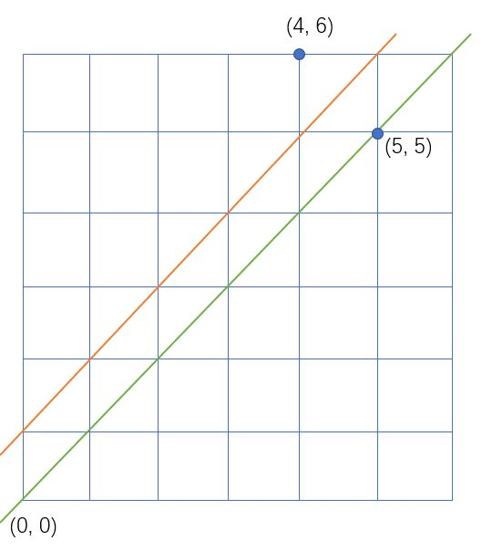

# 卡特兰数

以下两种情况都可以**识别**卡特兰数

- 递推式：$f(n) = f(1) * f(n - 1) + f(2) * f(n - 1) *...$
- 性质：任意前缀中，某种东西的个数**一定大于等于**另一种东西的个数

公式：

- $f(n) = C_{2n}^n - C_{2n}^{n - 1}$
- $f(n) = \frac{C_{2n}^n}{n + 1} $
- $f(n) = \frac{4n - 2}{n + 1}f(n - 1)$

卡特兰数的证明：



从原点出发，到终点(5, 5)，只能往右或往上走，走的时候不越过绿色的线。在这些条件下，到达终点有多少种合法走法。

使用容斥原理，`合法方案数 = 全部方案数 - 不合法方案数`。

1. 全部方案数：需要5次向右，5次向上，因此从10次里选5次往右走，故方案数为$C_{10}^5$
2. 不合法方案数：把绿色线向上平移一个单位，得到红色线，所有走到红色线上的都是非法方案。当我们第一次走到红色线上，将后面走出的线关于红线做轴对称，因此所有走到(5, 5)上的都等价于走到(4, 6)上，且两者是一一对应的。可以得到非法方案数为$C_{10}^4$

最终归纳可以得到卡特兰数：$C_{2n}^{n} - C_{2n}^{n - 1}$


## [满足条件的01序列](https://www.acwing.com/problem/content/891/)

```c++
#include<iostream>
using namespace std;
typedef long long LL;

const int mod = 1e9 + 7;

int n;

int qmi(int a, int k){
    int res = 1;
    while(k){
        if(k & 1)   res = (LL)res * a % mod;
        a = (LL)a * a % mod;
        k >>= 1;
    }
    return res;
}

int C(int a, int b){
    int up = 1, down = n + 1;
    for(int i = a, j = 1; j <= b; i--, j++){
        up = (LL)up * i % mod;
        down = (LL)down * j % mod;
    }
    return (LL)up * qmi(down, mod - 2) % mod;
}

int main(){
    cin >> n;
    cout << C(2 * n, n) << endl;
    return 0;
}
```


## [网格](https://www.acwing.com/problem/content/1317/)

这题卡特兰数的扩展

思路：从原点出发到终点，任何途经的点(x, y)要满足$x \ge y$，通过卡特兰数的性质，可以识别出这是考卡特兰数。此题的终点是(n, m)，总方案数为$C_{n + m}^n$，而非法方案数只要找到终点关于`y = x + 1`的对称点就可知道了。

找对称点有两种方法：1）直接利用几何性质计算；2）先把`y = x + 1`往下平移一个单位，那么终点坐标为(n, m - 1)，将该点对于`y = x`对称，得到(m - 1, n)，再把`y = x`往上平移一个单位，那么终点坐标为(m - 1, n + 1)。因此非法方案数为$C_{n + m}^{m - 1}$。

**要打高精，所以不能求逆元，只能求出所有的阶乘然后相减**

```c++
#include<iostream>
#include<vector>
using namespace std;

const int N = 1e4 + 5;

int primes[N], cnt;
bool st[N];

void mul(vector<int> &a, int b){
    int t = 0;
    for(int i = 0; i < a.size(); i++){
        t += a[i] * b;
        a[i] = t % 10;
        t /= 10;
    }
    while(t){
        a.push_back(t % 10);
        t /= 10;
    }
}

void sub(vector<int> &a, vector<int> &b){
    for(int t = 0, i = 0; i < a.size(); i++){
        a[i] -= t + (i >= b.size() ? 0 : b[i]);
        if(a[i] < 0){
            a[i] += 10;
            t = 1;
        }else   t = 0;
    }
}

void init(){
    for(int i = 2; i < N; i++){
        if(!st[i])  primes[cnt++] = i;
        for(int j = 0; i * primes[j] < N; j++){
            st[i * primes[j]] = true;
            if(i % primes[j] == 0)   break;
        }
    }
}

int get(int n, int p){
    int s = 0;
    while(n)    s += n / p, n /= p;
    return s;
}
// 阶乘分解
void C(vector<int>& res, int a, int b){
    for(int i = 0; i < cnt; i++){
        int p = primes[i];
        int s = get(a, p) - get(b, p) - get(a - b, p);
        while(s--)   mul(res, p);
    }
}

int main(){
    int n, m;
    cin >> n >> m;
    
    init();
    
    vector<int> a(1, 1), b(1, 1);
    C(a, n + m, n);
    C(b, n + m, n + 1);
    sub(a, b);
    
    int i = a.size() - 1;
    while(!a[i])    i--;
    while(i >= 0)   cout << a[i--];
    return 0;
}
```


## [有趣的数列](https://www.acwing.com/problem/content/1318/)

思路：通过构造分析，我们可以得到`在选择每个数为奇数项还是偶数项的时候，奇数项的个数要大于等于偶数项的个数`

可以取模，但是取模数不一定是质数，因此也只能阶乘分解；因为不用高精，结果乘上每个质数的积，这部分可以用快速幂优化。

```c++
#include<iostream>
using namespace std;
typedef long long LL;

const int N = 2e6 + 5;

int n, mod;
int primes[N], cnt;
bool st[N];

void init(int n){
    for(int i = 2; i <= n; i++){
        if(!st[i])  primes[cnt++] = i;
        for(int j = 0; i * primes[j] <= n; j++){
            st[i * primes[j]] = true;
            if(i % primes[j] == 0)  break;
        }
    }
}

int qmi(int a, int k){
    int res = 1;
    while(k){
        if(k & 1)   res = (LL)res * a % mod;
        a = (LL)a * a % mod;
        k >>= 1;
    }
    return res;
}

int get(int n, int p){
    int s = 0;
    while(n)    s += n / p, n /= p;
    return s;
}

int C(int a, int b){
    int res = 1;
    for(int i = 0; i < cnt; i++){
        int p = primes[i];
        int s = get(a, p) - get(b, p) - get(a - b, p);
        res = (LL)res * qmi(p, s) % mod;
    }
    return res;
}

int main(){
    cin >> n >> mod;
    init(n * 2);
    cout << (C(2 * n, n) - C(2 * n, n + 1) + mod) % mod << endl;
}
```

