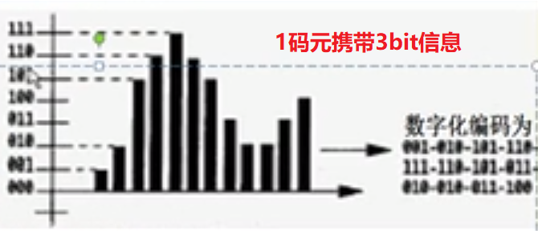

# 物理层

## 基本概念

机械特性（接口形状、大小）、电气特性（电压范围）、功能特性（如规定-5V为0，+5V为1）、过程特性

## 相关术语

通信的目的是传送消息

**数据（data）**：运输消息的实体

**信号（signal）**：数据的电气或电磁的表现，包括数字信号和模拟信号

**码元（code）**：在使用时间域的波形表示数字信号时，则代表不同离散数值的基本波形就称为码元。在数字通信中常常用时间间隔相同的符号来表示一个二进制数字，这样的时间间隔内的信号称为二进制码元（即一个码元携带1bit信息量）。而这个时间间隔被称为码元长度。1码元可以携带nbit的信息量

## 数据通信基础知识

信道：单工通信、半双工通信、全双工通信

---

基带信号：信源信号

带通信号：基带信号经过载波调制后的信号

对基带数字信号的几种调制方法

---

基带信号的常用编码：

1. 

2. 曼彻斯特编码

3. 差分曼彻斯特编码

---

信道极限容量

- 奈氏准则：没有噪音干扰，码元的传输速率有上限
- 香农公式：有信号干扰，无差错传输速率C=W log2(1+S/N)   b/s，W为无噪声时的传输速率，S/N为信噪比

## 物理层下面的传输媒体

网线

直通线

交叉线

## 信道复用技术

- 频分复用
- 时分复用：可能造成线路资源的浪费
- 统计时分复用：加标记，因而可以区分谁给谁
- 波分复用：就是光的频分复用

## 数字传输系统

E1（欧洲标准）

## 宽带接入技术

ADSL技术：非对称数字用户线路，低频接电话线，高频给上网用户使用（上行子信道为25，下行子信道为249），使用DMT技术（频分复用）

光纤同轴混合网HFC：使用有线电视网

FTTx（光纤到x）