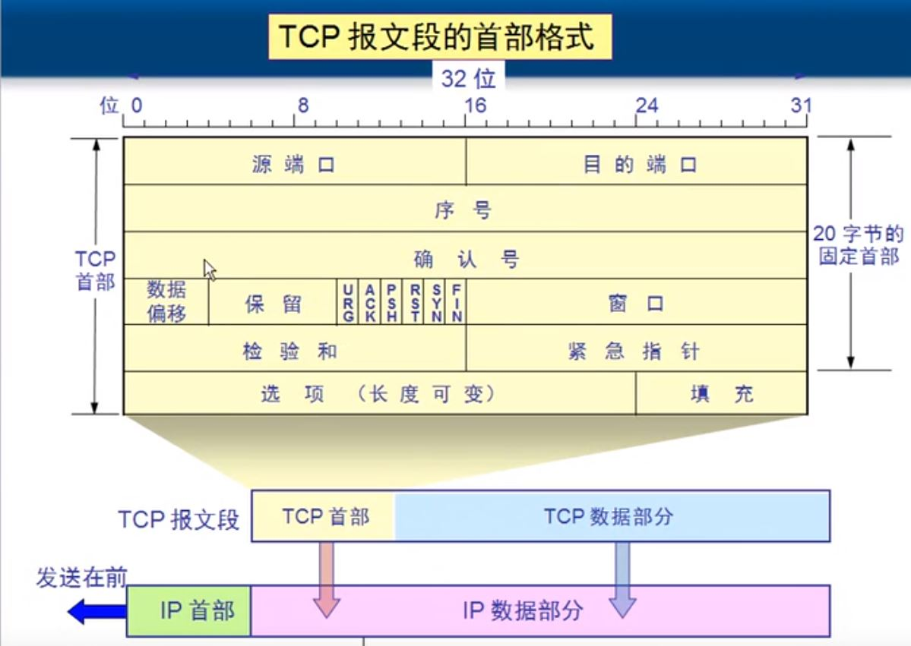

# 传输层

## 两个协议

### TCP

需要将传输的文件分段、传输要建立会话、可靠传输、流量控制

### UDP

一个数据包完成通信、不分段、不需要建立会话、不需要流量控制、不可靠传输

广播和多播用的是UDP（因为不建立会话）

### Windows的一些命令

查看会话 netstat -n

查看建立会话的进程 netstat -nb

远程桌面 mstsc

## 服务

### 一些服务

远程桌面（RDP）：TCP+3389

SMTP：TCP+25

DNS：TCP+53

POP3：TCP+110

- 服务使用TCP/UDP的端口侦听客户端请求

- 客户端使用IP地址定位服务器，使用目标端口定位服务

- 可以在服务器网卡上设置只开放必要的端口，实现服务器网络安全

  

### 如何查看服务器侦听的端口

  netstat -an 

  netstat -n ：查看建立的会话

  netstat -nb：查看建立会话的进程

  telnet IP port：测试远程计算机某个接口是否打开

## UDP的特点

1. UDP是无连接的
2. 面向报文的
3. 尽最大努力交付
4. 支持一对一、一对多、多对一、多对多的通信
5. 没有拥塞控制，因此网络拥塞不会使源主机发送速率降低（适合于流媒体）
6. 首部只有8个字节，开销小

## TCP的特点

1. 面向连接的
2. 面向字节流
3. 提供可靠交付
4. 只支持一对一通信
5. 全双工通信TCP 允许通信双方的应用进程在任何时候都能发送数据。TCP 连接的两端都设有发送缓存和接收缓存，用来临时存放双方通信的数据

### TCP可靠传输实现机制

停止等待协议和自动重传请求ARQ(Automatic Repeat reQuest)

**信道利用率低，故有了连续ARQ**：可以使用累积确认，也可以一个一个确认

### TCP报文段的首部格式

序号：TCP数据部分第一个字节是整个文件的第几个字节，序号就是几

确认号：告诉发送端下一次发送数据的首个字节

数据偏移：从哪个字节开始是数据部分，首部最大为15（1111）*4=60个字节，故可变长度部分最大为40字节

URG：为1时优先传输

ACK：为0则确认号失效，为1则有效

PSH：为1表示到达接收端后放在缓存的前面，以让应用程序更早读取

RST：为1表示出现错误，需要重新建立会话

SYN：为1表示建立会话的请求

FIN：为1表示请求释放连接

紧急指针：表示紧急数据的尾部位置，URG有效时才有用

可变选项：可以加SACK（选择性确认）

#### 三次握手

MSS=1460：最大支持的数据包

win=64240：最多可缓存64240个字节（win即窗口）

##### 通信

#### 选择性确认

### 流量控制

通过接收窗口的大小控制发送端的发送

### 慢开始和拥塞避免

拥塞避免并非是说完全能避免拥塞，而是说使网络较不容易出现拥塞

### 快重传和快恢复

**是对慢开始和拥塞避免的补充**

快重传：当丢包时，接收端不累积确认，而是连续发送三个确认让发送端重传，发送端立即重传丢失的包（而不是继续发送后面的包）

快恢复：当收到连续三个确认时，说明网络不拥塞，因此不是从开始，而是直接从慢开始门限开始

### 三次握手

客户端还要给服务器一个确认的原因：若服务器没收到确认，可以释放连接，否则浪费资源

### 四次分手

