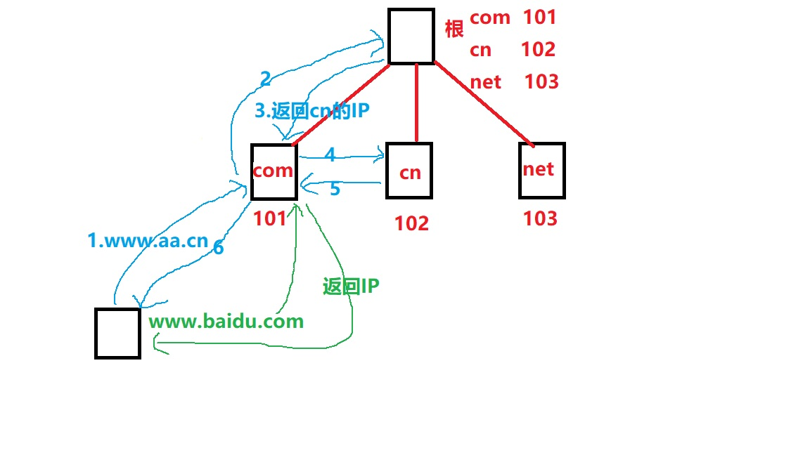
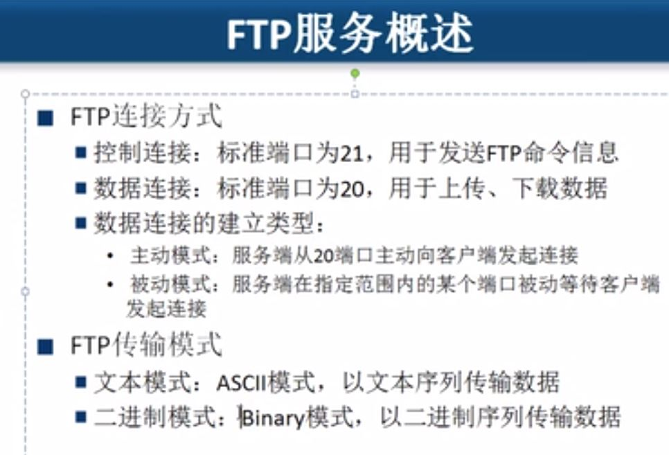

# 应用层

## 域名

### 顶级域名

com  cn  net  org  gov

### 二级域名

baidu  xiaomi  netease

### 三级域名

mail

### 域名测试

nslookup 域名

### 域名解析过程

## DHCP

动态主机配置协议：分配IP地址

使用RARP协议：通过广播将MAC地址解析为IP地址

## FTP

- 主动模式：FTP服务器告诉客户端使用什么端口侦听，使用这个端口和客户端建立连接（默认20）
- 被动模式：FTP客户端使用端口侦听，服务器通过某端口去建立连接。客户端不能下载
- FTP服务器端若有防火墙，需要打开20和21端口，且使用主动模式。没有就随意了

## Web代理

- 节省内网访问Internet的带宽（通过缓存）
- 通过代理绕过防火墙（因为防火墙只查看IP地址，不查看内部信息）
- 通过代理可以防止跟踪（比如发帖记录的是代理服务器的IP而不是实际的IP）
