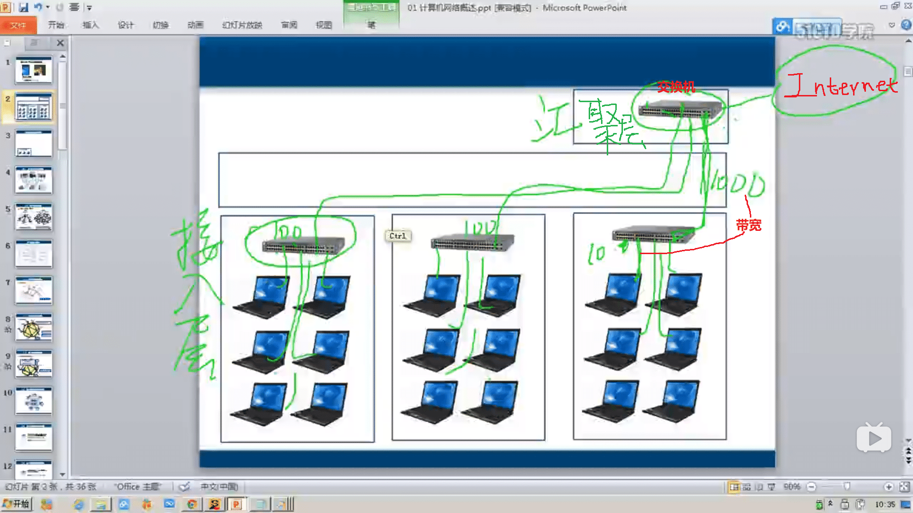
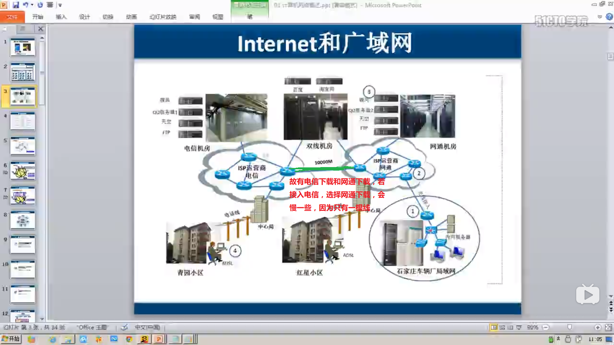
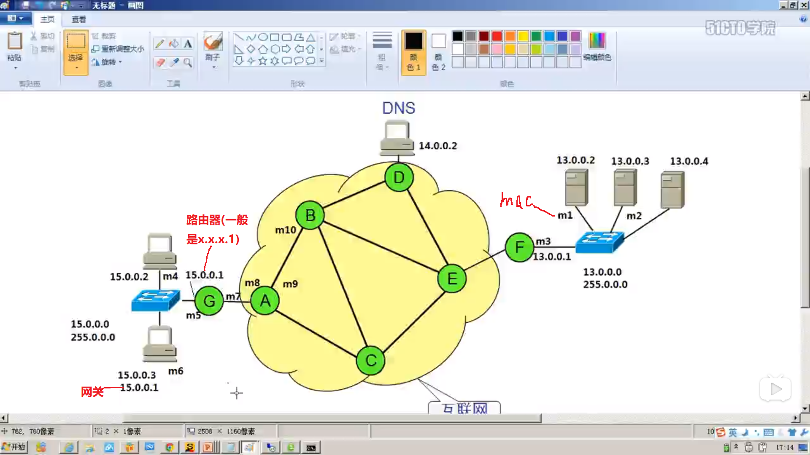

# 第一章：计算机网络概述

##  局域网

覆盖范围小	自己花钱买设备	带宽固定		自己维护		小于100米	带宽10M、100M、1000M

## Internet

ISP	自己的机房	为网民提供访问Internet连接

## 广域网

距离远（超过100米）		花钱租宽带	带宽有100M，但访问国外网站时，可能经过多个ISP，还是可能较慢，因为容易拥塞

## 规划IP地址

## 数据包和数据帧

