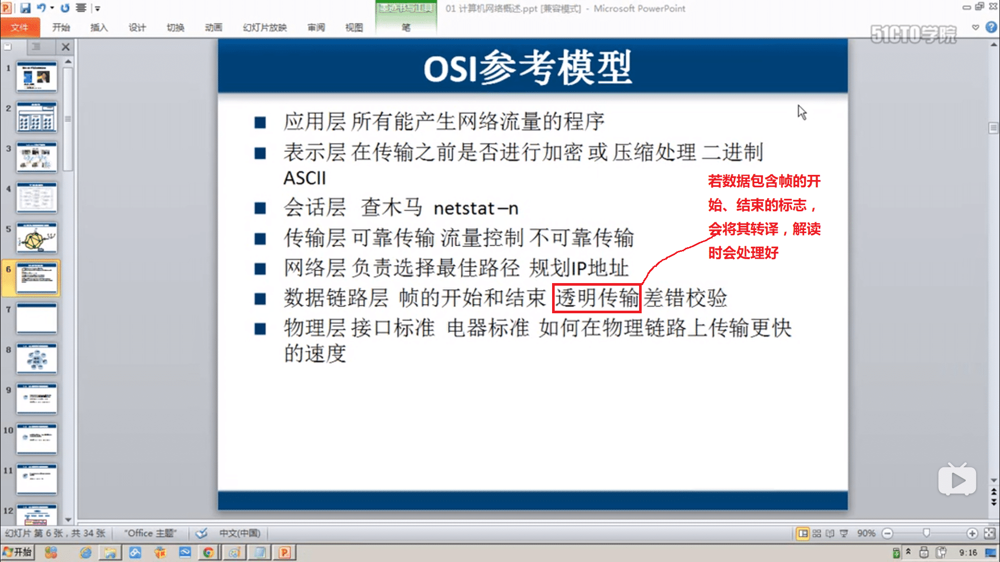
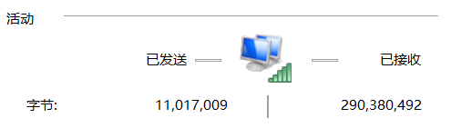

# 第一章：计算机网络概述

##  局域网

覆盖范围小	自己花钱买设备	带宽固定		自己维护		小于100米	带宽10M、100M、1000M

## Internet

ISP	自己的机房	为网民提供访问Internet连接

## 广域网

距离远（超过100米）		花钱租宽带	带宽有100M，但访问国外网站时，可能经过多个ISP，还是可能较慢，因为容易拥塞

## 规划IP地址

## 数据包和数据帧

## OSI参考模型

## OSI参考模型对网络排错的指导

指导思想：从底层到高层排错

1. 物理层故障：查看连接状态	发送和接收数据包

   

2. 数据链路层故障：MAC地址冲突   ASDL欠费   网速协商不一致（默认是协商为较低的带宽）   计算机连接到错误的VLAN中

3. 网络层故障：配置错误的IP地址    子网掩码    配置错误的网关    路由器上没有配置达到目标的路由

## 计算机网络性能指标

1. 速率：主机在每个数字信道上传送**数据位数**的速率（比特率），不是总的
2. 带宽：网络设备支持的最高数据率
3. 吞吐量：单位时间通过某个网络的数据量，这是总的
4. 时延=发送时延+传播时延+处理时延+排队时延，光纤传播速度比铜线慢，但是支持的带宽比铜线大
5. 时延带宽积=传播时延×带宽，即有多少数据在线路上
6. 往返时间（RTT）：从发送方开始到发送方收到接收方的确认
7. 利用率