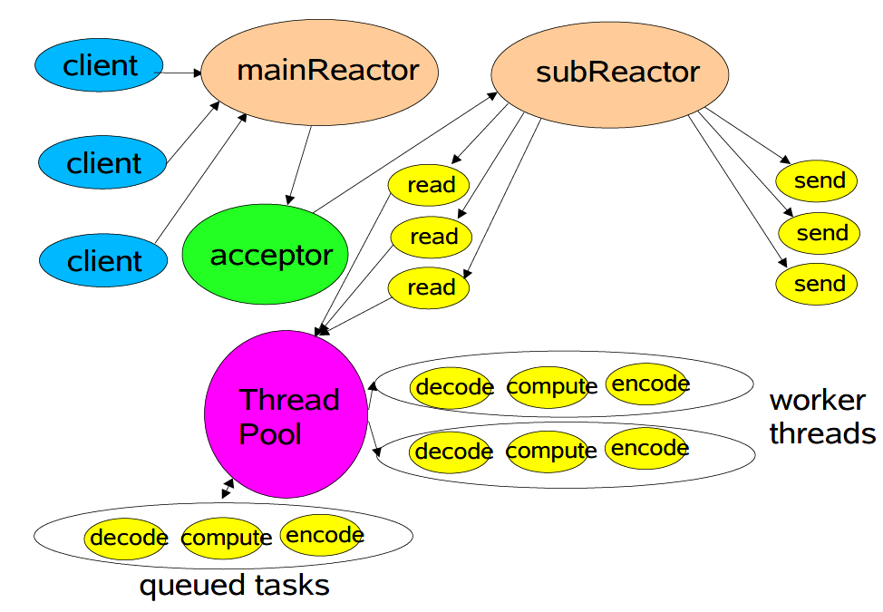
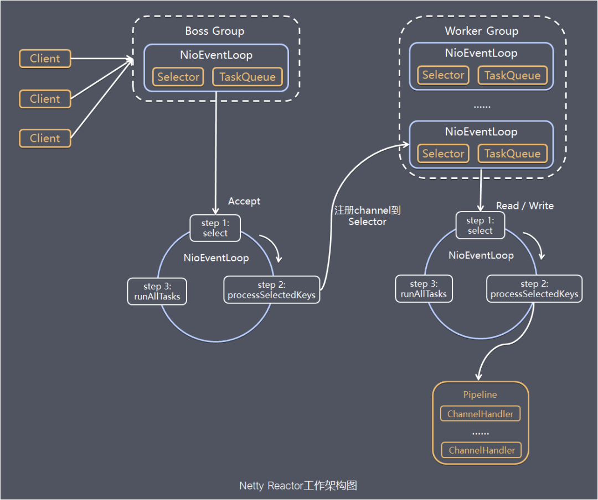

## 线程模型

1. 传统阻塞IO服务模型
2. Reactor模式
   - 单Reactor单线程
   - 单Reactor多线程
   - 主从Reactor多线程：Netty基于该模型并做了一定的改进

## Reactor模式

传统阻塞IO服务模型的缺点，提出的解决方案：

1. 基于IO复用模型：多个连接共用一个阻塞对象，应用程序只需要在一个阻塞对象上等待，而无需阻塞等待所有连接
2. 基于线程池复用线程资源：不必再为每个连接创建线程

### 单Reactor单线程

NIO群聊系统就是该实现，没有用到线程池复用

#### 优点

模型简单，没有多线程之间的竞争问题

#### 缺点

1. 无法发挥多核CPU的性能。Handler在处理某个连接上的业务时，整个进程无法处理其他的事件，容易导致性能瓶颈
2. 可靠性问题。线程意外终止或者进入死循环，会导致整个系统通信模块不可用

#### 使用场景

客户端数量有限，业务处理非常快，比如Redis

### 单Reactor多线程

#### 解释

1. Reactor对象通过select监听客户端事件，收到事件后分派
2. 如果是建立连接的请求，由Acceptor通过accept处理连接请求，然后创建一个Handler用于处理后续的其他事件
3. 如果不是建立连接请求，由Reactor分发调用连接对应的Handler来处理
4. Handler只负责响应事件（读和写）。通过read读取数据后，将具体的业务处理交由Worker线程池
5. Worker线程池分配线程完成业务后，将结果返回给Handler
6. Handler通过send将结果返回给客户端

#### 优点

可以充分利用多核CPU的处理能力

#### 缺点

1. Reactor处理所有的事件的监听和响应，在单线程运行，高并发场景下容易成为性能瓶颈。IO压力过大时一个Reactor处理能力会饱和
2. 多线程数据共享和访问比较复杂（线程池线程的数据共享和访问，一个解决方案是ThreadLocal）。但是主从Reactor也没有解决呀

### 主从Reactor多线程

#### 工作原理图

一主多从

#### 解释

1. MainReactor通过select监听客户端连接事件，通过Acceptor处理连接事件
2. Acceptor处理连接事件后，MainReactor将连接分配给合适的SubReactor
3. SubReactor将连接加入到连接队列中进行监听，并创建Handler进行处理事件
4. 有新事件发生时，SubReactor调用对应的Handler进行处理
5. Handler通过read读取数据后，将具体的业务处理交由Worker线程池
6. Worker线程池分配线程完成业务后，将结果返回给Handler
7. Handler通过send将结果返回给客户端

#### 优点

1. 父线程和子线程的数据交互简单，职责明确，父线程只需要接收新连接，子线程完成后续的处理
2. Reactor负载均衡，更好地和CPU、IO使用率相配
3. 解决单Reactor处理能力饱和问题

#### 缺点

编程复杂

#### 使用场景

Ngnix主从Reactor多进程模型、Memcached主从Reactor多线程、Netty主从Reactor多线程模型的改进

## Netty模型

### 工作原理图

### 解释

1. Netty抽象出两组线程池： BossGroup 专门负责接收客户端的连接, WorkerGroup 专门负责网络的读写
2. BossGroup 和 WorkerGroup 类型都是 NioEventLoopGroup
3. NioEventLoopGroup 相当于一个事件循环组，这个组中含有多个事件循环（NioEventLoop）
4. 每个NioEventLoop 都有一个selector，用于监听绑定在其上的socket的网络通讯
6. 每个Boss NioEventLoop 循环执行的步骤有3步：

   1. 轮询accept 事件

   2. 处理accept 事件 , 与client建立连接 , 生成NioSocketChannel，并将其注册到某个worker NioEventLoop 上的 selector

   3. 处理任务队列的任务，即 runAllTasks
7. 每个 Worker NioEventLoop 循环执行的步骤

   1. 轮询read，write 事件

   2. 处理i/o事件，即read，write 事件，在对应NioScocketChannel 处理

   3. 处理任务队列的任务 ， 即 runAllTasks
8. 每个Worker NioEventLoop 处理业务时，会使用pipeline(管道)，pipeline 中包含了 channel，也维护了很多的Handler

## 问题汇总

1. Netty对主从Reactor多线程做了什么改进？

   - 多主多从
   - 

2. 为什么单Reactor多线程会存在高并发的瓶颈？明明一个连接会有对应的Handler来处理，也用了多线程，那我如果用主从Reactor多线程，在资源相同的情况下，不应该效果会变差吗？

   

