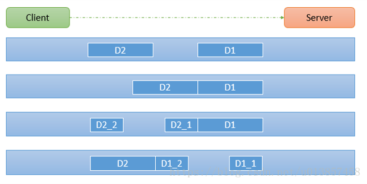

# Netty详解

## 重要组成部分

### EventLoopGroup

`bossGroup`和`workerGroup`默认会启动`CPU核数×2`个`NioEventLoop`，它内部维护了`EventExcutor`的数组，`NioEventLoop`是`EventExcutor`的一个实现类

### EventLoop

几个重要的属性：

- Java NIO的`Selector`
- 在`SingleThreadEventExecutor`里的`Queue<Runnable> taskQueue`。存放自定义的普通任务
- 在`AbstractScheduledEventExecutor`里的`PriorityQueue<ScheduledFutureTask<?>> scheduledTaskQueue`，优先级是最早开始执行的时间。存放自定义定时任务

### ChannelHandlerContext

几个重要的属性：

- `prev/next`：以链表形式组织多个`ChannelHandlerContext`
- `handler`：自定义handler处理通道信息
- `pipeline`：管道
  - `head/tail`：第一个和最后一个`ChannelHandlerContext`。如果是InBound，则从head到tail的顺序处理，如果是OutBound，则从tail到head的顺序处理
  - Netty的`channel`
    - `pipeline`：两者互相拥有对方的引用
    - `EventLoop`：关联的worker

### 任务队列

1. 自定义普通任务：提交到taskQueue
2. 自定义定时任务：提交到scheduledTaskQueue
3. 非当前Reactor线程调用Channel的各种方法：推送消息，根据用户标识找出对应的Channel，写入数据后提交到任务队列里

### Future-Listen机制

每个Future都可以绑定监听事件，当Future完成后，由监听器处理逻辑

### ByteBuf

Netty提供的缓冲区，和Java NIO不同，有三个属性：readerIndex，writerIndex，capacity。其中，[0, readerIndex)是丢弃区域，[readerIndex, writerIndex)是可读区域，[writerIndex, capacity)是可写区域

### 编解码器codec

Netty提供的

1. StringEncoder/StringDecoder
2. ObjectEncoder/ObjectDecoder：可以用来实现POJO对象或者各种业务对象的编码和解码，底层使用的是Java序列化技术，而Java序列化技术效率不高。存在的问题是：1）无法跨语言；2）序列化后体积太大，是二进制编码的5倍多；3）序列化性能太低
3. HttpServerCodec
4. **`ReplayingDecoder<S>`：扩展自ByteToMessageDecoder，S指定用户状态管理的类型，用Void表示不管理。可以不用再判断`in.readableBytes()`的长度，它内部会处理，而ByteToMessageDecoder不判断可能会不正确**
5. LineBasedFrameDecoder：以行尾控制符（`\n or \r\n`）作为分隔符解析数据
6. DelimiterBasedFrameDecoder：自定义的特殊字符作为消息分隔符
7. HttpObjectDecoder/HttpObjectEncoder：HTTP数据的解码器
8. LengthFieldBasedFrameDecoder：通过指定长度来标识整包数据，可以自动处理粘包和半包消息

#### Protobuf

介绍：

1. Protobuf是一种轻便高效的**结构化数据存储格式**，可用于结构化数据序列化，**适合做数据存储或RPC数据交换格式**。补充：RPC转型，从http+json转型成tcp+protobuf
2. 以**message**的方式管理数据
3. 跨语言

简单使用步骤：

1. `pom.xml`中引入坐标
2. 编写`proto`文件
3. 使用`protoc.exe --java_out=. Student.proto`生成Java文件
4. 拷贝到项目中，然后配置`ProtobufEncoder和ProtobufDecoder`
5. 参考[Protobuf案例](7Netty案例.md)

### 入站和出站

入站：从 Channel 到客户端/服务器。Handler 调用顺序是从 head 到 tail

出站：从客户端/服务器到 Channel 。Handler 调用顺序是从 tail 到 head

第一个 Handler 一般放编解码Handler

注意：

- **编码器接收到的消息类型必须与其指定的数据类型一致**，否则不编码直接 write。参照`MessageToByteEncoder`的`write`方法
- **解码器进行数据解析时，需要判断缓冲区（ByteBuf）的数据是否足够**，否则接收到的结果可能和期望结果不一致。是解决 TCP 粘包拆包问题的一种方法。decode 会被调用多次，直到确定没有新的元素被添加到 List，或者是 ByteBuf 没有更多的可读字节

案例：[自定义编解码器案例](7Netty案例.md)

### TCP 粘包和拆包

产生原因：TCP 将多个间隔较小且数据量小的数据，合并成一个大的数据块，然后进行封包，从而提高了效率。但是使得接收端难以分辨完整的数据包，因为**面向流的通信是无消息保护边界的**。处理该问题就是粘包和拆包

案例：[TCP 粘包和拆包案例](7Netty案例.md)

#### 解决方案

使用 自定义协议+编解码器 解决

案例：[TCP 粘包和拆包解决方案](7Netty案例.md)

