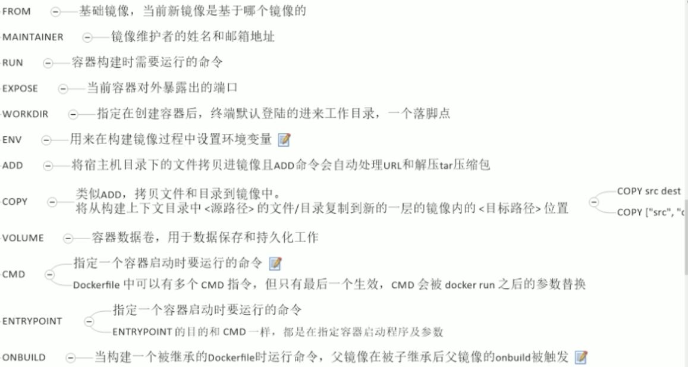

# docker

## 安装docker

1. 安装Linux虚拟机，以Ubuntu为例
2. 设置虚拟机网络，以VirtualBox为例：网络——>桥接网络——>选择网卡（有线网和无线网是不同的）——>接入网线
3. 使用命令重启虚拟机网络
4. 查看Linux的IP地址     `ip addr`
5. Ubuntu安装ssh服务    `sudo apt-get install openssh-server`
6. 注意Ubuntu禁止root远程登陆
7. 使用ssh客户端连接
8. Ubuntu使用命令   `sudo apt install docker.io`，过时。使用docker-ce比较好，具体参照官方文档

## 启动docker

```shell
service docker start
```

## 阿里云docker镜像

[阿里云docker镜像](https://www.cnblogs.com/anliven/p/6218741.html)

## docker常用操作

```shell
1.检索
sudo docker search mysql
2.拉取
sudo docker pull 镜像名:tag
3.查看本地镜像
sudo docker images
4.删除本地镜像
sudo docker rmi image-id
5.启动容器
sudo docker start 容器id
6.停止运行中的容器
sudo docker stop 容器id
7.查看所有容器
sudo docker ps -a
8.删除容器（容器必须停止）
sudo docker rm 容器id
9.启动一个做了端口映射的容器
sudo docker run -h tom --name mytomcat -d -p 8888:8080 tomcat
-h：指定主机名称
--name:指定容器名，可以不指定
-d:后台运行
-p:主机端口：容器端口
10.查看防火墙状态、开启与关闭
sudo ufw status
sudo ufw enable
sudo ufw disable
```

```shell
1. 运行操作系统，如Ubuntu
sudo docker run -it ubuntu
-i:以交互方式运行
-t:打开伪终端
1.1 退出容器
exit：容器停止退出
ctrl+P+Q：容器不停止退出
2. 查看容器
sudo docker ps 查看运行中的容器
sudo docker ps -l 查看上一次运行的容器
sudo docker ps -n num 查看最近的num个容器
3.查看容器日志
sudo docker logs 容器名/容器id
-t：打印时间
-f：跟随最新的日志打印
--tail num：打印最后num条
4. 查看容器内部细节
sudo docker inspect 容器id
5. 进入容器以命令行交互
sudo docker attach 容器id：直接进入容器启动命令的终端，不启动新的进程
sudo docker exec -it 容器id bashShell：
e.g.
sudo docker exec -it 2b598045c316 ls /tmp：直接打印tmp目录，然后返回到宿主机终端
sudo docker exec -it 2b598045c316 /bin/bash：此时效果类似与attach
6. 容器中的文件拷贝到宿主机中
sudo docker cp 容器id:文件位置 宿主机文件位置
7. 提交容器副本使之成为新的镜像
sudo docker commit -m="信息" -a="作者" 容器id 要创建的目标镜像名:tag
8. 命令组合
sudo docker rm $(sudo docker ps -aq)：删除所有容器
9. 容器随着系统启动而启动
sudo docker update mysql --restart=always
sudo docker update redis --restart=always
sudo docker update sec-mq --restart=always
```

## 容器数据卷

1. 命令添加

    ```shell
    1. 映射
    sudo docker run -it -v /宿主机绝对路径目录:/容器内路径目录 镜像名
    2. 查看是否挂载成功
    sudo docker inspect 镜像id：查看volume选项
    3. 只读数据卷（宿主机可用写，容器只能读）
    sudo docker run -it -v /宿主机绝对路径目录:/容器内路径目录:ro 镜像名
    ```

2. DockerFile添加

   - 是什么：构建镜像的构建文件，由命令和脚本组成

   - 如何做：

     1. 编写dockerfile文件

        ```dockerfile
        FROM ubuntu
        VOLUME ["/dataVolumeContainer1","/dataVolumeContainer2"]
        CMD echo "finish"
        CMD /bin/bash
        ```

     2. `sudo docker build -f dockerfile位置 -t 镜像名 .`：生成镜像

     3. 运行镜像，容器生成的容器数据卷会在宿主机上有对应的默认位置

3. 数据共享

   ```shell
   sudo docker run -it --name xx --volumes-from 另一个容器名 镜像名
   ```

   数据卷将会共享，只要还有容器存活着（就算父容器消亡了）

## Dockerfile

**每条指令都会创建一个新的镜像层，并对镜像进行提交**



**CMD和ENTRYPOINT的不同**：使用CMD时，若执行`sudo docker run -it 镜像名 -t`，一定会报错，因为-t将会覆盖最后的CMD命令，执行-t命令，显然没有-t命令；而使用ENTRYPOINT执行`sudo docker run -it 镜像名 -t`，不一定会报错，只要ENTRYPOINT的命令支持-t参数（相当于让命令同时执行-t参数所示意义）

### 示例

```dockerfile
FROM ubuntu
MAINTAINER sonkabin<sonkabin1996@gmail.com>
COPY a.txt /usr/local/abc.txt
ADD jdk-8u151-linux-x64.tar.gz /usr/local
ADD apache-tomcat-8.5.24.tar.gz /usr/local
ENV MYPATH /usr/local
WORKDIR $MYPATH
ENV JAVA_HOME=/usr/local/jdk1.8.0_151
ENV CATALINA_HOME=/usr/local/apache-tomcat-8.5.24/
ENV PATH $PATH:$JAVA_HOME/bin:$CATALINA_HOME/bin
EXPOSE 8080

# ENTRYPOINT ["/usr/local/apache-tomcat-8.5.24/bin/startup.sh"]
CMD ["/usr/local/apache-tomcat-8.5.24/bin/catalina.sh", "run"] && tail -F /usr/local/apache-tomcat-8.5.24/bin/logs/catalina.out
```


### Dockerfile问题

1. 使用ubuntu时，需要先`RUN apt-get update `后才能进行其他的`apt-get install`安装