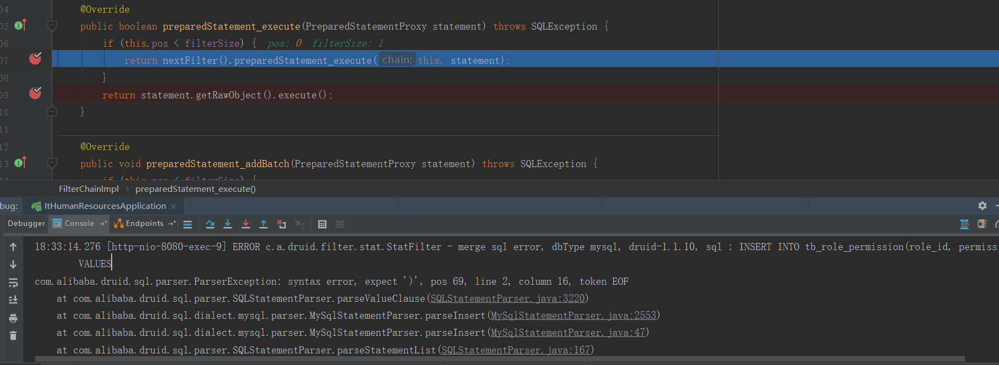

# IT企业人力资源管理系统

## MyBatisPlus

- 有些版本不依赖mybatis-plus-generator，比如3.0.7.1。。。所有最好选择有依赖的，如3.0.4，否则自己添加依赖可能导致一个是3.x版本，一个是2.x版本

- MyBatisPlus3.0代码生成器模板文件不能放在templates文件夹下，若如此做，会使它去读取`mybatis-plus-generator-3.0.4.jar`的templates下的模板，应该自定义一个文件夹，然后在生成器中指定模板

  ```java
  3.x//若仍旧沿用2.x版本，不会在自己的resources下的templates查找，而是去mybatis-plus-generator-3.0.4.jar的templates下查找
  TemplateConfig tc = new TemplateConfig();
  tc.setController("/mytemplates/controller.java");
  tc.setService("/mytemplates/service.java");
  tc.setServiceImpl("/mytemplates/serviceImpl.java");
  tc.setXml(null);//不让其同时在mapper包下生成xml文件
  mpg.setTemplate(tc);
  
  2.x//会在自己的resources下的templates查找
  TemplateConfig tc = new TemplateConfig();
  tc.setController("/templates/controller.java");
  tc.setService("/templates/service.java");
  tc.setServiceImpl("/templates/serviceImpl.java");
  tc.setXml(null);//不让其同时在mapper包下生成xml文件
  mpg.setTemplate(tc);
  ```

- 当需要多表查询时，需要在此类中引用其他类，并且需要排除此字段（非表字段），[排除非表字段的三种方法](https://mp.baomidou.com/guide/faq.html#%E5%A6%82%E4%BD%95%E6%8E%92%E9%99%A4%E9%9D%9E%E8%A1%A8%E4%B8%AD%E5%AD%97%E6%AE%B5%EF%BC%9F)

  ```java
  @TableName("tb_employee")
  public class Employee implements Serializable {
      @TableId(value = "id", type = IdType.AUTO)
      private Integer id;
      private transient  Role role;
      // getter & setter
  }
  ```

## MyBatis

1. **返回List**时，resultType应写为POJO类

   ```java
   List<User> findAll();
   ```

   ```xml
   <select id="findAll" resultType="com.sonkabin.bean.User">
       select * from user
   </select>
   ```

2. 多表查询时，需要使用resultMap，且连接的表中有与此表中有相同的列名，**通过别名解决**，如下的Role中的id

   ```xml
   <resultMap id="empWithRoleResultMap" type="com.sonkabin.entity.Employee">
       <id property="id" column="id"></id>
       <result property="empId" column="emp_id"></result>
       <association property="role" javaType="com.sonkabin.entity.Role">
           <id property="id" column="rid"/>
           <result property="roleName" column="role_name"/>
       </association>
   </resultMap>
   <select id="getEmpWithRoleById" resultMap="empWithRoleResultMap">
       SELECT e.id, e.emp_id, r.id rid, r.role_name
       FROM tb_employee e
       LEFT OUTER JOIN tb_role r ON e.role_id = r.id
       WHERE e.id = #{id}
   </select>
   ```

3. 问题1
    MySQL:查询员工的工作时间比例是否分配完，且项目状态为1
    ```sql
    SELECT hc.emp_id empId, SUM(portion) empPortion FROM tb_human_config hc
    RIGHT JOIN tb_employee e ON hc.emp_id = e.id
    WHERE hc.status = 1 AND e.id
    IN (2,3,6,8,15,16)
    GROUP BY e.id
    ```
    转换成MyBatis语法
    ```java
    Map<String, Object> selectPortion(List<Employee> employees);
    ```
    ```xml
    <!-- 对应的mapper.xml文件 -->
    <select id="selectPortion" parameterType="java.util.List" resultType="java.util.Map">
      SELECT hc.emp_id empId, SUM(portion) empPortion FROM tb_human_config hc
      RIGHT JOIN tb_employee e ON hc.emp_id = e.id
      WHERE hc.status = 1 AND e.id
      IN
      <foreach collection="list" item="item" open="(" close=")" separator=",">
          #{item.id}
      </foreach>
      GROUP BY e.id
    </select>
    ```
    **注意：MyBatis使用SUM时，返回的是java.math.BigDecimal,而不是Integer**,要获得int值使用`((BigDecimal)item.get(x)).intValue()`

## 前后台交互

### @RequestBody

后台接收json数组

```java
@ResponseBody
@PostMapping("/config")
public Message saveConfig (@RequestBody List<HumanConfig> configs) {
    return Message.success();
}
```

前台传递json数组

```javascript
// 版本1，报错,HTTP状态码415，后台报错信息：Resolved [org.springframework.web.HttpMediaTypeNotSupportedException: Content type 'application/x-www-form-urlencoded;charset=UTF-8' not supported]
$.ajax({
    url: baseUrl + '/config',
    method: 'POST',
    data: data, 
    dataType: 'json',
    success: function () {}
})
// 版本2，报错,HTTP状态码400，后台报错信息：Resolved [org.springframework.http.converter.HttpMessageNotReadableException: JSON parse error: Unrecognized token 'undefined': was expecting ('true', 'false' or 'null');
$.ajax({
    url: baseUrl + '/config',
    method: 'POST',
    data: data, 
    dataType: 'json',
    contentType: "application/json",
    success: function () {}
})
// 正确版本
$.ajax({
    url: baseUrl + '/config',
    method: 'POST',
    data: JSON.stringify(data), // 必须将json数组转化成字符串
    dataType: 'json',
    contentType: "application/json", // 使用了它，必须将json转化成字符串
    success: function () {}
})
```

### Ajax同时上传表单序列化参数+自定义参数

```javascript
$.ajax({
    url: '',
    method: 'PUT',
    data: $('#edit-form').serialize() +'&'+$.param({'param1': value1, 'param2':value2})
})
```

### FormData

```javascript
// 使用jQuery不能获取form的数据，如替换为var form = $('#add-form')是不能成功运行的
var form = document.getElementById('add-form')
var formData = new FormData(form)
$.ajax({
    url: url,
    method: 'POST',
    data: formData,
    processData:false, // 设为false,因为data值是FormData对象，不需要对数据做处理
    contentType:false, // 设为false,因为FormData是由表单构造的对象，且已经声明了属性enctype="multipart/form-data"，所以这里设置为false
    success: function () {
    }
})
```

### 文件下载

Chrome中测试成功

```html
<!-- 下载的标签，download为H5的属性 -->
<a download class="btn btn-primary btn-sm download-btn" id=' + id + '>下载简历</a>
```

```javascript
$(document).on('click', '.download-btn', function () {
    $(this).attr('href', baseUrl + '/download/' + $(this).attr('id')).click()
})
```

后台代码

```java
@ResponseBody
@GetMapping("/download/{id}")
public ResponseEntity<byte[]> download (@PathVariable("id") Integer id) throws IOException {
    Recruit recruit = recruitService.getRecruitById(id);
    String resumePath = recruit.getResumePath();
    String[] split = resumePath.split("/");
    File file = new File(resumePath);
    // 处理显示中文文件名的问题
    // split[split.length - 1]得到文件名
    String fileName = new String(split[split.length - 1].getBytes("utf-8"),"ISO-8859-1");
    // 设置请求头内容,告诉浏览器代开下载窗口
    HttpHeaders headers = new HttpHeaders();
    headers.setContentDispositionFormData("attachment", fileName);
    headers.setContentType(MediaType.APPLICATION_OCTET_STREAM);
    ResponseEntity<byte[]> responseEntity = new ResponseEntity<>(FileUtils.readFileToByteArray(file), headers, HttpStatus.CREATED);
    return responseEntity;
}
```


## js

函数

```javascript
// parents()和parent()方法不同
$(this).parents('tr') // 直接找
$(this).parent() // 一个一个找
// find()方法很强，如
$(this).find('td:eq(0)') // 找第一个td节点
```

全局变量

```javascript
// 方式一：使用var，定义在function外面
var test

// 方式二：没有使用var，直接给标识符test赋值，这样会隐式的声明了全局变量test。即使该语句是在一个function内，当该function被执行后test变成了全局变量。
test = 5 // 这种其实是在global下创建一个property
```

删除数组元素

```javascript
var a = [1,2,3]
/* 	splice(index, len, [item])
	删除：index表示开始位置，len表示删除长度，item为空，例如a.splice(1,1), a=[1,3]
	替换：index表示开始位置，len表示要替换的长度，item表示替换项，例如a.splice(0,2,9), a=[9,3]
	添加：index表示插入位置，len设为0，item表示添加项，例如a.splice(1,0,9), a=[1,9,2,3]
*/
```


选中checkbox

```javascript
$('#checkbox-node').prop("checked", true)
```


## 注解

注解可以多个标注在一个参数/方法/类上

```java
@ResponseBody
@PostMapping("/humanConfig")
public Message saveConfig (@RequestBody List<HumanConfig> configs, @DateTimeFormat(pattern = "yyyy-MM-dd") @RequestParam("endDate") LocalDate endDate) {
    return humanConfigService.saveConfig(configs, endDate);
}
```


## MySQL

MySQL connector[官方文档](https://dev.mysql.com/doc/connector-j/8.0/en/connector-j-reference-configuration-properties.html)

```
allowMultiQueries
Allow the use of ';' to delimit multiple queries during one statement (true/false). Default is 'false', and it does not affect the addBatch() and executeBatch() methods, which rely on rewriteBatchStatements instead.
Default: false
Since version: 3.1.1

解释就是允许分号作为多个查询的分隔符，而批量更新在将其设置为true也能进行批量更新了
```

```xml
<update id="updateBatch">
    <foreach collection="list" item="item" separator=";">
        UPDATE tb_project_history SET contribute = #{item.contribute}
        WHERE project_id = #{item.projectId} AND emp_id = #{item.empId}
    </foreach>
</update>
```

需求：将多行的数据在一行显示

完整语法：`GROUP_CONCAT([DISTINCT]字段 [ORDER BY ASC/DESC 排序字段] [SEPARATOR '分隔符'])`

Sample:

```mysql
SELECT GROUP_CONCAT(p.permission_name separator '-'),GROUP_CONCAT(p.permission_code) ,r.role_name FROM tb_permission p, tb_role r, tb_role_permission rp
WHERE rp.role_id = r.id AND p.id = rp.permission_id
GROUP BY r.role_name
```


## Java中的正则表达式

String的split()方法签名

```java
public String[] split(String regex, int limit);
public String[] split(String regex);
```

因此必须要注意有些情况的转义字符，如`.`

```java
String s = "mca.ca.f";
String[] split = s.split("."); // 错误写法，.表示任意字符
String[] split = s.split("\\."); // 正确写法，.表示点
```


## 由一次事务不回滚的思考

```java
// 事务配置的相关注解
@EnableTransactionManagement // 注解到Configuration类上
@Transactional // Service层注解
```

问题出现：在方法中执行删除和新增操作时，删除操作成功，新增操作失败，抛出了异常，事务却没有回滚

**执行语句如下**

```java
xxxMapper.deleteBatchIds(rolePermissionIds); // 1.正常执行
xxxMapper.insertBatch(roleId, idsList); // 2.异常抛出处
```

**异常的信息如下**

```
com.alibaba.druid.sql.parser.ParserException: syntax error, expect ')', pos 69, line 2, column 16, token EOF

java.sql.SQLSyntaxErrorException: You have an error in your SQL syntax; 
```

非常奇怪，就想理解一下Spring的事务，找来官方文档，记录一些以前没有注意到的盲点

- Spring建议只将@Transactional注解到具体类上和它的方法上

  如果使用基于类的代理（`proxy-target-class="true"`）或weaving-based aspect ( `mode="aspectj"`)，因为Java接口上的注解不能被继承，则代理识别不了，事务不生效

- > In proxy mode (which is the default), only external method calls coming in through the proxy are intercepted. This means that self-invocation, in effect, a method within the target object calling another method of the target object, will not lead to an actual transaction at runtime even if the invoked method is marked with `@Transactional`. Also, the proxy must be fully initialized to provide the expected behaviour so you should not rely on this feature in your initialization code, i.e. `@PostConstruct`.

  如果想让self-invocation能被事务作用，则需要使用AspectJ mode

- **任何RuntimeException会触发回滚，任何受检异常则不会**

  **答案显然在这里**，`ParserException`是RuntimeException，而`SQLSyntaxErrorException`是受检异常。**减少一个权限，默认情况下，事务发送一条delete语句，insert失败抛出异常，数据库改变，而当交换1和2两行代码时，数据库不发生改变**。

  - 减少一个权限情况：通过debug发现，先抛出`com.alibaba.druid.sql.parser.ParserException`异常，然后又抛出`SQLSyntaxErrorException`异常，其中第一个是RuntimeException，而第二个是受检异常。问题在于为什么第一个异常抛出后，程序还能执行到抛出第二个异常处？如图所示。这暂时不能解释，嘤嘤嘤~，但可以解释为什么事务没有回滚。**原因：异常丢失。比如在catch子句中抛出另一个异常类型，若不用异常链处理，将丢失原始异常细节（Java核心技术卷Ⅰ原书第10版 P274）。因此，由于最后为受检异常，故事务没有回滚**。

  - 搞了半天，通过debug发现，在任何异常还未抛出之前，delete语句已经执行，也就是说上面的都不成立，只是因为这两个方法执行过程中不是一个事务

    

  - 增加一个权限情况：抛出`com.mysql.cj.exceptions.WrongArgumentException`异常，属于运行时异常，事务回滚

- 单应用多个事务管理器，暂不展开

- 事务传播(Spring事务管理中，需要理解物理事务和逻辑事务)

  - 什么是事务传播行为？即由某一个事务传播行为修饰的方法被嵌套进另一个方法的时事务如何传播
  - 物理事务：底层数据库的事务支持，如JDBC或JTA提供的事务
  - 逻辑事务：Spring管理的事务，不同于物理事务，逻辑事务提供更丰富的控制
  - Required（默认）：每个方法都会创建自己的逻辑事务，所有的逻辑事务会映射成一个物理事务，因此一旦其中一个内部事务有了回滚标记，将会影响外部事务。但如果物理事务不决定回滚，将抛出`UnexpectedRollbackException`异常
  - Requires New：每个方法创建自己的物理事务，可以设置自己的隔离级别、超时、只读设置，也可以独立决定提交还是回滚
  - Nested：使用一个有多个能回滚的储存点的物理事务，因此部分内部事务回滚，外部事务仍旧继续执行。因为该设置要映射到JDBC的储存点，因此只能在有JDBC resource transactions的情况下工作。请看Spring的DataSourceTransactionManager

- 